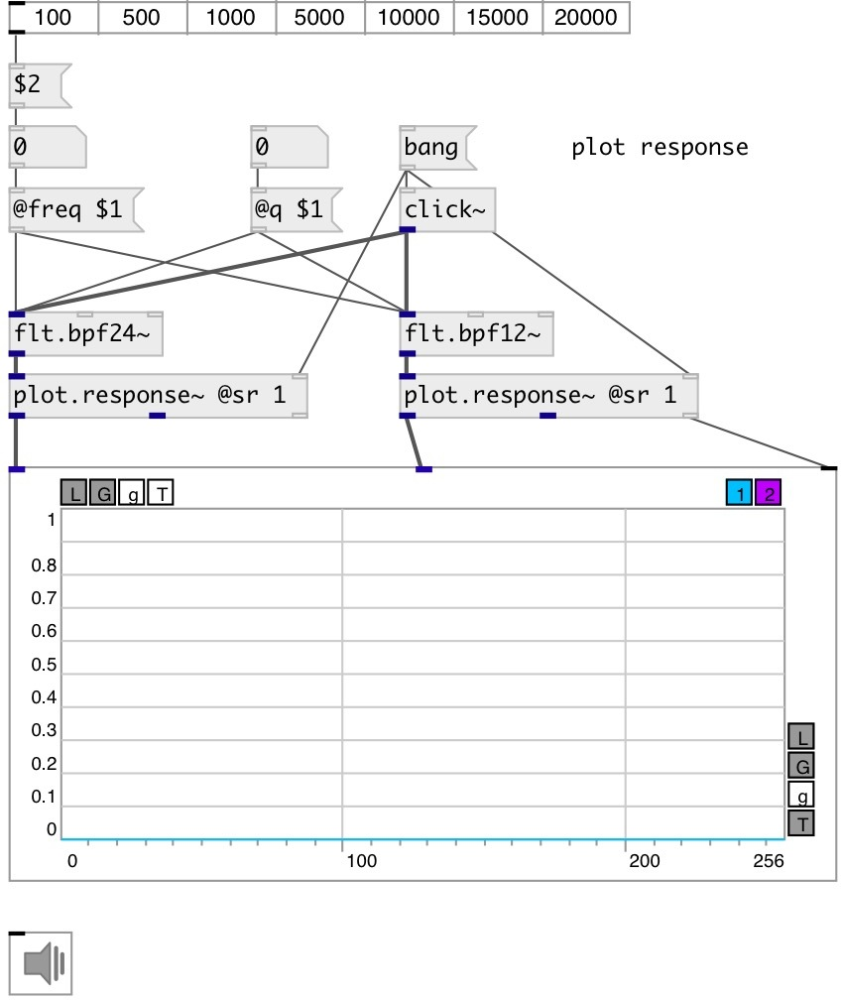

[index](index.html) :: [flt](category_flt.html)
---

# flt.bpf24~

###### Four pole band-pass butterworth filter

*доступно с версии:* 0.1

---

## информация
Band-pass filter passes frequencies within a certain range and rejects frequencies outside that range. Butterworth filter is a type of filter designed to have a frequency response as flat as possible in the passband.

## аргументы:

* **freq**
center frequency 
_тип:_ float 
_единица:_ Hz 

* **q**
quality factory: @freq/BANDWIDTH 
_тип:_ float 

* **ID**
object ID for OSC control 
_тип:_ symbol 

## методы:

* **reset**
reset filter state 

## свойства:

* **@freq** 
Получить/установить cutoff frequency 
_тип:_ float 
_единица:_ Hz 
_диапазон:_ 20..20000 
_по умолчанию:_ 1000 

* **@q** 
Получить/установить quality factor: @freq/BANDWIDTH 
_тип:_ float 
_диапазон:_ 0.01..100 
_по умолчанию:_ 2 

* **@active** 
Получить/установить on/off dsp processing 
_тип:_ int 
_варианты:_ 0, 1 
_по умолчанию:_ 1 

## входы:

* input signal 
_тип:_ audio

## выходы:

* filtered signal 
_тип:_ audio

## ключевые слова:

[filter](keywords/filter.html)
[biquad](keywords/biquad.html)
[bpf](keywords/bpf.html)

**Смотрите также:**
[\[flt.bpf12~\]](flt.bpf12~.html)

**Авторы:** Alex Nadzharov, Serge Poltavsky

**Лицензия:** GPL3 or later

