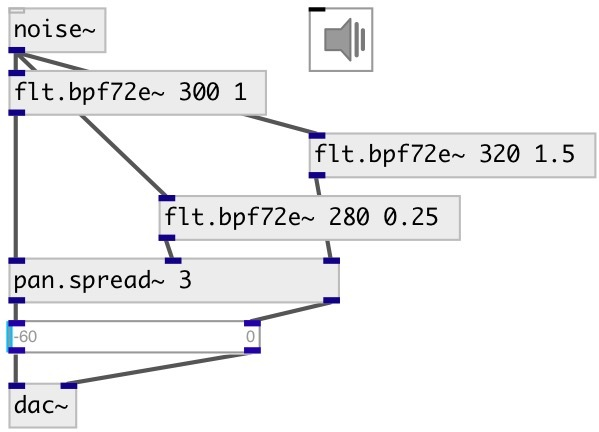

[index](index.html) :: [flt](category_flt.html)
---

# flt.bpf72e~

###### elliptic band-pass filter with -72db rolloff

*доступно с версии:* 0.9.7

---

## информация
Band-pass filter passes frequencies within a certain range and rejects frequencies outside that range.

## аргументы:

* **FREQ**
center frequency 
_тип:_ float 
_единица:_ Hz 

* **Q**
quality factory: @freq/BANDWIDTH 
_тип:_ float 

## методы:

* **reset**
reset filter state 

## свойства:

* **@freq** (initonly)
Запросить/установить cutoff frequency 
_тип:_ float 
_единица:_ Hz 
_диапазон:_ 20..20000 
_по умолчанию:_ 1000 

* **@q** (initonly)
Запросить/установить quality factor: @freq/BANDWIDTH 
_тип:_ float 
_диапазон:_ 0.25..32 
_по умолчанию:_ 2 

* **@active** 
Запросить/установить on/off dsp processing 
_тип:_ bool 
_по умолчанию:_ 1 

* **@osc** (initonly)
Запросить/установить OSC server name to listen 
_тип:_ symbol 

* **@id** (initonly)
Запросить/установить OSC address id. If specified, bind all properties to /ID/flt_bpf72e/PROP_NAME
osc address, if empty bind to /flt_bpf72e/PROP_NAME. 
_тип:_ symbol 

## входы:

* input signal 
_тип:_ audio

## выходы:

* filtered signal 
_тип:_ audio

## ключевые слова:

[filter](keywords/filter.html)
[elliptic](keywords/elliptic.html)
[bpf](keywords/bpf.html)

**Смотрите также:**
[\[flt.bpf24~\]](flt.bpf24~.html)

**Авторы:** Serge Poltavsky

**Лицензия:** GPL3 or later

