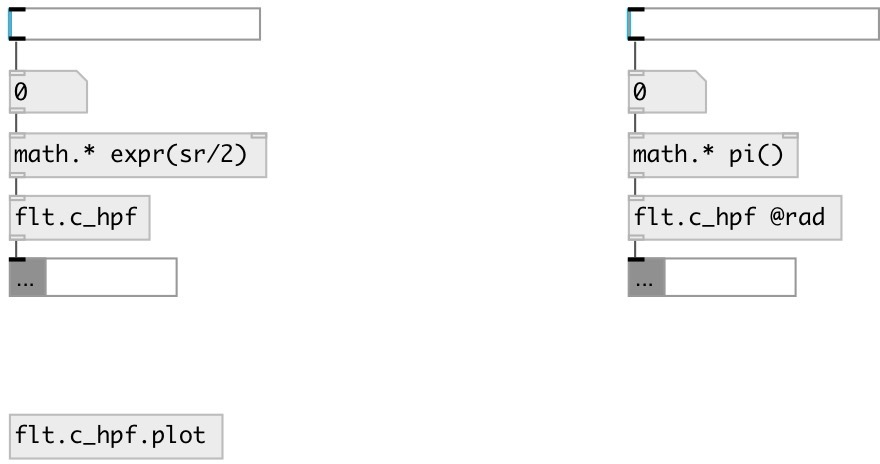

[index](index.html) :: [flt](category_flt.html)
---

# flt.c_hpf

###### HPF coefficient calculator for biquad filter

*доступно с версии:* 0.9.2

---

## информация
Calculates coefficients for transfer function: H(z)=(b0 + b1*z⁻¹ + b2*z⁻²)/(1 + a1*z⁻¹ + a2*z⁻²)

## аргументы:

* **freq**
center frequency 
_тип:_ float 
_единица:_ Hz 

## методы:

* **bw**
set bandwidth in octaves 
  __параметры:__
  - **OCT** bandwidth 
    тип: float  
    обязательно: True  

## свойства:

* **@freq** 
Получить/установить center frequency 
_тип:_ float 
_единица:_ Hz 
_диапазон:_ 20..22050 
_по умолчанию:_ 1000 

* **@q** 
Получить/установить quality factor: @freq/BANDWIDTH 
_тип:_ float 
_диапазон:_ 0.01..100 
_по умолчанию:_ 0.707107 

* **@rad** 
Получить/установить use angular frequency 
_тип:_ flag 

## входы:

* filter frequency 
_тип:_ control

## выходы:

* list: b0 b1 b2 a1 a2 
_тип:_ control

## ключевые слова:

[filter](keywords/filter.html)
[biquad](keywords/biquad.html)
[hpf](keywords/hpf.html)
[highpass](keywords/highpass.html)

**Смотрите также:**
[\[flt.c_lpf\]](flt.c_lpf.html)

**Авторы:** Serge Poltavsky

**Лицензия:** GPL3 or later

