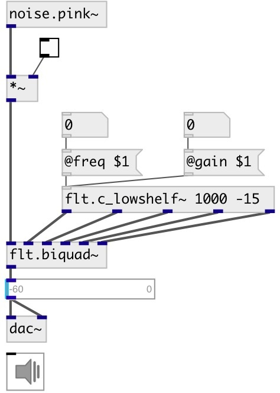

[index](index.html) :: [flt](category_flt.html)
---

# flt.c_lowshelf~

###### Lowshelf filter coefficient calculator for biquad

*доступно с версии:* 0.1

---

## информация
gain boost|cut below some frequency Calculates coefficients for transfer function: H(z)=(b0 + b1*z⁻¹ + b2*z⁻²)/(1 + a1*z⁻¹ + a2*z⁻²)

## аргументы:

* **FREQ**
cutoff frequency 
_тип:_ float 
_единица:_ Hz 

* **GAIN**
filter gain 
_тип:_ float 
_единица:_ db 

## свойства:

* **@freq** 
Запросить/установить center frequency 
_тип:_ float 
_единица:_ Hz 
_диапазон:_ 20..20000 
_по умолчанию:_ 1000 

* **@gain** 
Запросить/установить filter gain 
_тип:_ float 
_единица:_ db 
_диапазон:_ -15..15 
_по умолчанию:_ 0 

* **@active** 
Запросить/установить on/off dsp processing 
_тип:_ bool 
_по умолчанию:_ 1 

* **@osc** (initonly)
Запросить/установить OSC server name to listen 
_тип:_ symbol 

* **@id** (initonly)
Запросить/установить OSC address id. If specified, bind all properties to
/ID/flt_c_lowshelf/PROP_NAME osc address, if empty bind to
/flt_c_lowshelf/PROP_NAME. 
_тип:_ symbol 

## входы:

* control input 
_тип:_ control

## выходы:

* b0 
_тип:_ audio
* b1 
_тип:_ audio
* b2 
_тип:_ audio
* a1 
_тип:_ audio
* a2 
_тип:_ audio

## ключевые слова:

[filter](keywords/filter.html)
[lowshelf](keywords/lowshelf.html)

**Смотрите также:**
[\[flt.lowshelf~\]](flt.lowshelf~.html)
[\[flt.biquad~\]](flt.biquad~.html)

**Авторы:** Alex Nadzharov, Serge Poltavsky

**Лицензия:** GPL3 or later

