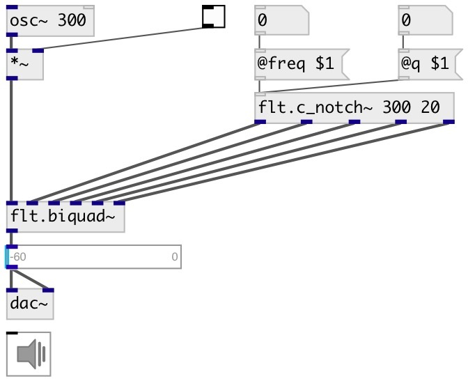

[index](index.html) :: [flt](category_flt.html)
---

# flt.c_notch~

###### Band-reject coefficient calculator for biquad filter

*доступно с версии:* 0.1

---

## информация
Calculates coefficients for transfer function: H(z)=(b0 + b1*z⁻¹ + b2*z⁻²)/(1 + a1*z⁻¹ + a2*z⁻²)

## аргументы:

* **FREQ**
center frequency 
_тип:_ float 
_единица:_ Hz 

* **Q**
quality factory 
_тип:_ float 

## свойства:

* **@freq** 
Запросить/установить center frequency 
_тип:_ float 
_единица:_ Hz 
_диапазон:_ 20..20000 
_по умолчанию:_ 1000 

* **@q** 
Запросить/установить quality factor: @freq/BANDWIDTH 
_тип:_ float 
_диапазон:_ 0.01..100 
_по умолчанию:_ 1 

* **@active** 
Запросить/установить on/off dsp processing 
_тип:_ bool 
_по умолчанию:_ 1 

## входы:

* control signal 
_тип:_ control

## выходы:

* b0 
_тип:_ audio
* b1 
_тип:_ audio
* b2 
_тип:_ audio
* a1 
_тип:_ audio
* a2 
_тип:_ audio

## ключевые слова:

[filter](keywords/filter.html)
[biquad](keywords/biquad.html)
[notch](keywords/notch.html)
[reject](keywords/reject.html)

**Смотрите также:**
[\[flt.c_bpf~\]](flt.c_bpf~.html)
[\[flt.notch~\]](flt.notch~.html)
[\[flt.biquad~\]](flt.biquad~.html)

**Авторы:** Alex Nadzharov, Serge Poltavsky

**Лицензия:** GPL3 or later

