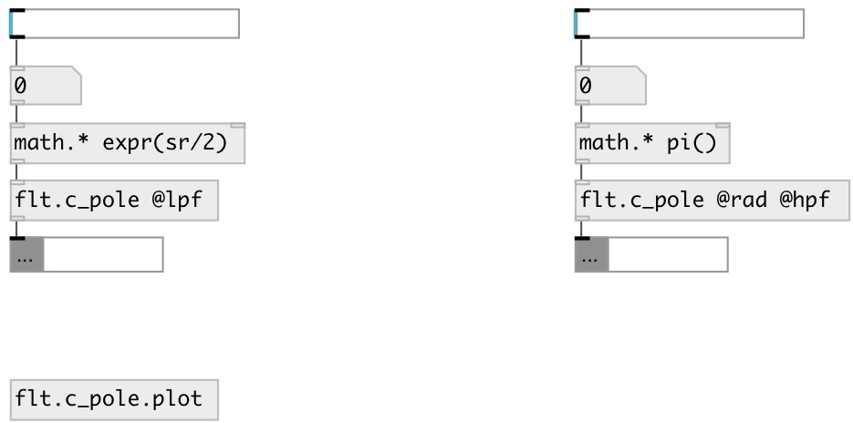

[index](index.html) :: [flt](category_flt.html)
---

# flt.c_pole

###### One-pole coefficient calculator for biquad filter

*доступно с версии:* 0.9.2

---

## информация
Calculates coefficients for transfer function: H(z)=(b0 + b1*z⁻¹ + b2*z⁻²)/(1 + a1*z⁻¹ + a2*z⁻²)

## аргументы:

* **FREQ**
center frequency 
_тип:_ float 
_единица:_ Hz 

## свойства:

* **@freq** 
Запросить/установить center frequency 
_тип:_ float 
_единица:_ Hz 
_диапазон:_ 0..22050 
_по умолчанию:_ 1000 

* **@rad** (initonly)
Запросить/установить use angular frequency 
_тип:_ flag 

* **@mode** 
Запросить/установить filter modey 
_тип:_ symbol 
_варианты:_ hpf, lpf 
_по умолчанию:_ lpf 

* **@lpf** 
Запросить/установить to @mode lpf 
_тип:_ alias 

* **@hpf** 
Запросить/установить ti @mode hpf 
_тип:_ alias 

## входы:

* filter frequency 
_тип:_ control

## выходы:

* list: b0 b1 b2 a1 a2 
_тип:_ control

## ключевые слова:

[filter](keywords/filter.html)
[biquad](keywords/biquad.html)
[one](keywords/one.html)
[pol](keywords/pol.html)

**Смотрите также:**
[\[flt.c_lpf\]](flt.c_lpf.html)

**Авторы:** Serge Poltavsky

**Лицензия:** GPL3 or later

