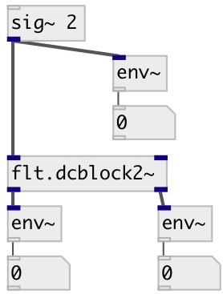

[index](index.html) :: [flt](category_flt.html)
---

# flt.dcblock2~

###### stereo DC blocker

*доступно с версии:* 0.1

---

## информация
Stereo DC blocker. It has -3dB point near 35 Hz (at 44.1 kHz) and high-frequency gain near 1.0025 (due to no scaling).

## свойства:

* **@active** 
Получить/установить on/off dsp processing 
_тип:_ int 
_варианты:_ 0, 1 
_по умолчанию:_ 1 

## входы:

* right input signal 
_тип:_ audio
* left input signal 
_тип:_ audio

## выходы:

* left filtered signal 
_тип:_ audio
* right filtered signal 
_тип:_ audio

## ключевые слова:

[filter](keywords/filter.html)
[dcblock](keywords/dcblock.html)

**Смотрите также:**
[\[flt.dcblock~\]](flt.dcblock~.html)

**Авторы:** Serge Poltavsky

**Лицензия:** GPL3 or later

