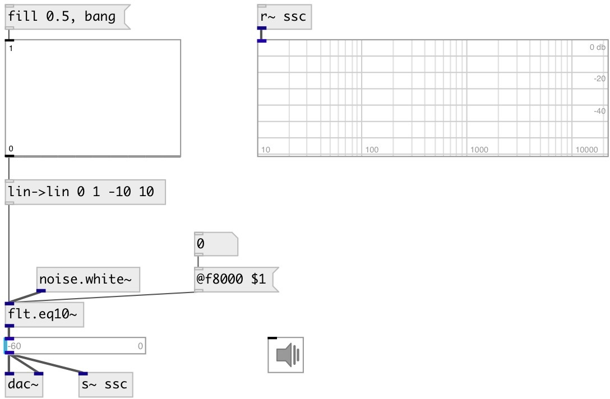

[index](index.html) :: [flt](category_flt.html)
---

# flt.eq10~

###### graphic 10 band equalizer

*доступно с версии:* 0.1

---

## информация
One band per octave. 5th-order Butterworth filters

## методы:

* **reset**
reset filter state to default 

## свойства:

* **@f31** 
Запросить/установить gain at 31.25Hz 
_тип:_ float 
_единица:_ db 
_диапазон:_ -70..10 
_по умолчанию:_ 0 

* **@f62** 
Запросить/установить gain at 62.5Hz 
_тип:_ float 
_единица:_ db 
_диапазон:_ -70..10 
_по умолчанию:_ 0 

* **@f125** 
Запросить/установить gain at 125Hz 
_тип:_ float 
_единица:_ db 
_диапазон:_ -70..10 
_по умолчанию:_ 0 

* **@f250** 
Запросить/установить gain at 250Hz 
_тип:_ float 
_единица:_ db 
_диапазон:_ -70..10 
_по умолчанию:_ 0 

* **@f500** 
Запросить/установить gain at 500Hz 
_тип:_ float 
_единица:_ db 
_диапазон:_ -70..10 
_по умолчанию:_ 0 

* **@f1000** 
Запросить/установить gain at 1000Hz 
_тип:_ float 
_единица:_ db 
_диапазон:_ -70..10 
_по умолчанию:_ 0 

* **@f2000** 
Запросить/установить gain at 2000Hz 
_тип:_ float 
_единица:_ db 
_диапазон:_ -70..10 
_по умолчанию:_ 0 

* **@f4000** 
Запросить/установить gain at 4000Hz 
_тип:_ float 
_единица:_ db 
_диапазон:_ -70..10 
_по умолчанию:_ 0 

* **@f8000** 
Запросить/установить gain at 8000Hz 
_тип:_ float 
_единица:_ db 
_диапазон:_ -70..10 
_по умолчанию:_ 0 

* **@f16000** 
Запросить/установить gain at 16000Hz 
_тип:_ float 
_единица:_ db 
_диапазон:_ -70..10 
_по умолчанию:_ 0 

* **@active** 
Запросить/установить on/off dsp processing 
_тип:_ bool 
_по умолчанию:_ 1 

* **@osc** (initonly)
Запросить/установить OSC server name to listen 
_тип:_ symbol 

* **@id** (initonly)
Запросить/установить OSC address id. If specified, bind all properties to /ID/flt_eq10/PROP_NAME osc
address, if empty bind to /flt_eq10/PROP_NAME. 
_тип:_ symbol 

## входы:

* input signal 
_тип:_ audio

## выходы:

* output signal 
_тип:_ audio

## ключевые слова:

[graphic](keywords/graphic.html)
[filter](keywords/filter.html)
[equalizer](keywords/equalizer.html)

**Смотрите также:**
[\[flt.eq_peak~\]](flt.eq_peak~.html)

**Авторы:** Serge Poltavsky

**Лицензия:** GPL3 or later

