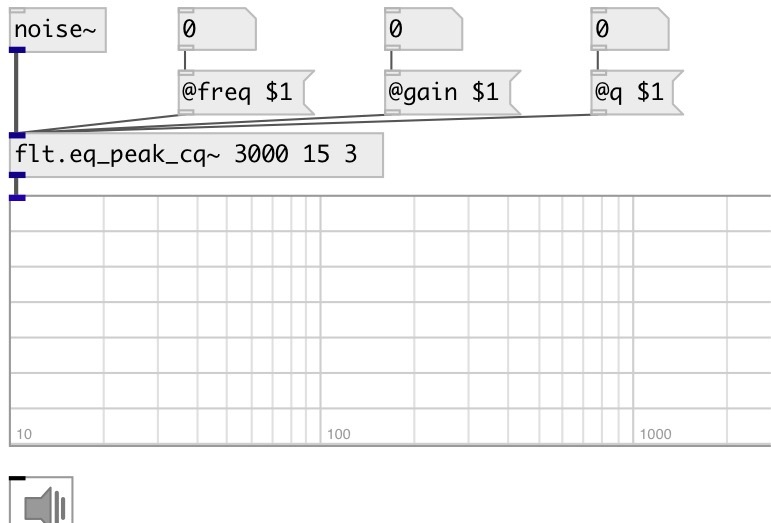

[index](index.html) :: [flt](category_flt.html)
---

# flt.eq_peak_cq~

###### constant-Q second order peaking equalizer section

*доступно с версии:* 0.6

---

## аргументы:

* **freq**
center frequency 
_тип:_ float 
_единица:_ Hz 

* **gain**
filter gain 
_тип:_ float 
_единица:_ db 

* **q**
quality factory 
_тип:_ float 

## свойства:

* **@freq** 
Получить/установить center frequency 
_тип:_ float 
_единица:_ Hz 
_диапазон:_ 20..20000 
_по умолчанию:_ 1000 

* **@gain** 
Получить/установить filter gain 
_тип:_ float 
_единица:_ db 
_диапазон:_ -15..15 
_по умолчанию:_ 0 

* **@q** 
Получить/установить quality factor: @freq/BANDWIDTH 
_тип:_ float 
_диапазон:_ 0.1..100 
_по умолчанию:_ 3 

* **@active** 
Получить/установить on/off dsp processing 
_тип:_ int 
_варианты:_ 0, 1 
_по умолчанию:_ 1 

## входы:

* input signal 
_тип:_ control

## выходы:

* filtered signal 
_тип:_ audio

## ключевые слова:

[filter](keywords/filter.html)
[equalizer](keywords/equalizer.html)

**Смотрите также:**
[\[flt.eq_peak~\]](flt.eq_peak~.html)

**Авторы:** Serge Poltavsky

**Лицензия:** GPL3 or later

