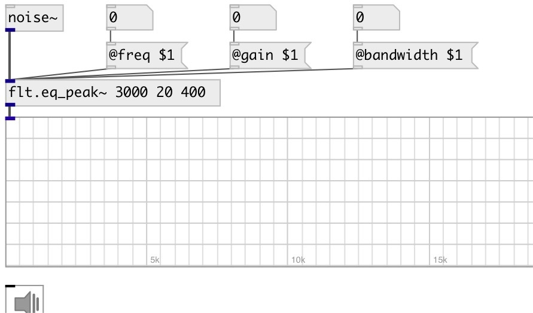

[index](index.html) :: [flt](category_flt.html)
---

# flt.eq_peak~

###### second order &#34;peaking equalizer&#34; section (gain boost or cut near some frequency). Also called a &#34;parametric equalizer&#34; section.

*доступно с версии:* 0.1

---

## аргументы:

* **freq**
peak frequency 
_тип:_ float 
_единица:_ Hz 

* **gain**
level at fx (boost if &gt;0 or cut if &lt;0) 
_тип:_ float 
_единица:_ db 

* **bandwidth**
bandwidth of peak 
_тип:_ float 
_единица:_ Hz 

## свойства:

* **@freq** 
Получить/установить peak frequency 
_тип:_ float 
_единица:_ Hz 
_диапазон:_ 20..20000 
_по умолчанию:_ 1000 

* **@gain** 
Получить/установить level at fx (boost if &gt;0 or cut if &lt;0) 
_тип:_ float 
_единица:_ db 
_диапазон:_ -15..15 
_по умолчанию:_ 0 

* **@bandwidth** 
Получить/установить bandwidth of peak 
_тип:_ float 
_единица:_ Hz 
_диапазон:_ 1..5000 
_по умолчанию:_ 100 

* **@active** 
Получить/установить on/off dsp processing 
_тип:_ int 
_варианты:_ 0, 1 
_по умолчанию:_ 1 

## входы:

* input signal 
_тип:_ audio

## выходы:

* filtered signal 
_тип:_ audio

## ключевые слова:

[filter](keywords/filter.html)
[equalizer](keywords/equalizer.html)

**Смотрите также:**
[\[flt.eq_peak_cq~\]](flt.eq_peak_cq~.html)
[\[flt.lowshelf~\]](flt.lowshelf~.html)
[\[flt.highshelf~\]](flt.highshelf~.html)

**Авторы:** Alex Nadzharov, Serge Poltavsky

**Лицензия:** GPL3 or later

