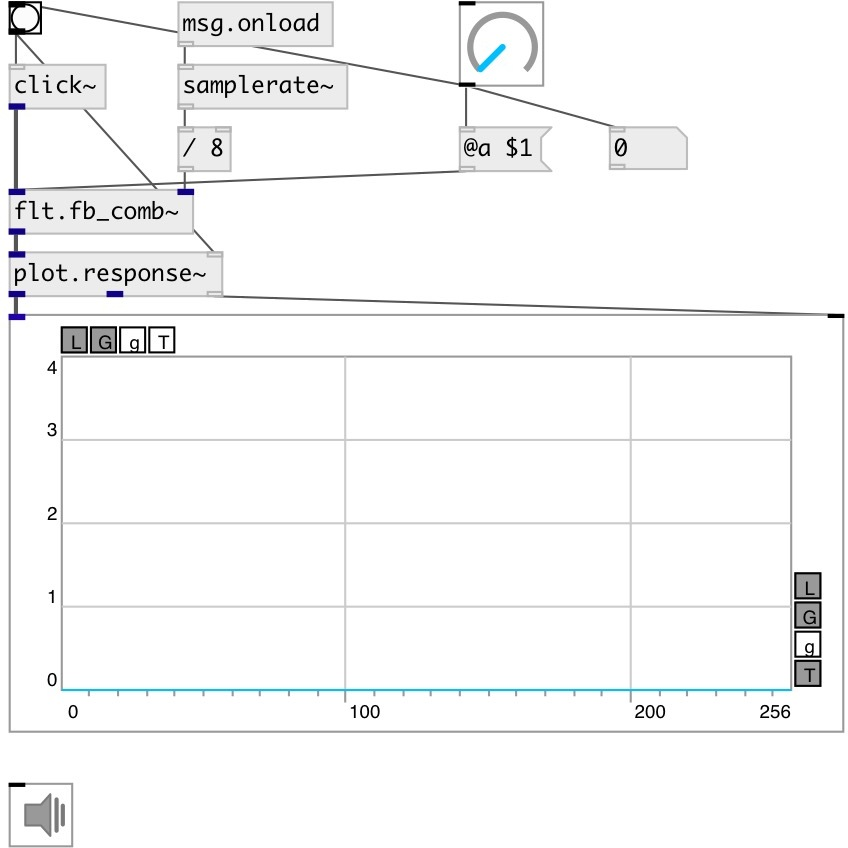

[index](index.html) :: [flt](category_flt.html)
---

# flt.fb_comb~

###### feedback comb filter

*доступно с версии:* 0.9.1

---

## информация
Frequency response of a comb filter consists of a series of regularly spaced notches, giving the appearance of a comb Structure of a feedforward comb filter may be described by the following difference equation: y[n]=x[n]+αy[n-K]} where K is the delay length (measured in samples), and α is a scaling factor applied to the delayed sum

## аргументы:

* **A**
scaling factor of delayed sum 
_тип:_ float 

## методы:

* **reset**
reset filter state 

## свойства:

* **@a** 
Запросить/установить scaling factor of delayed signal sum 
_тип:_ float 
_диапазон:_ -1..1 
_по умолчанию:_ 0.75 

* **@active** 
Запросить/установить on/off dsp processing 
_тип:_ bool 
_по умолчанию:_ 1 

* **@osc** (initonly)
Запросить/установить OSC server name to listen 
_тип:_ symbol 

* **@id** (initonly)
Запросить/установить OSC address id. If specified, bind all properties to /ID/flt_fb_comb/PROP_NAME
osc address, if empty bind to /flt_fb_comb/PROP_NAME. 
_тип:_ symbol 

## входы:

* input signal 
_тип:_ audio
* filter notch frequency 
_тип:_ audio

## выходы:

* filtered signal 
_тип:_ audio

## ключевые слова:

[filter](keywords/filter.html)
[comb](keywords/comb.html)

**Смотрите также:**
[\[flt.ff_comb~\]](flt.ff_comb~.html)

**Авторы:** Serge Poltavsky

**Лицензия:** GPL3 or later

