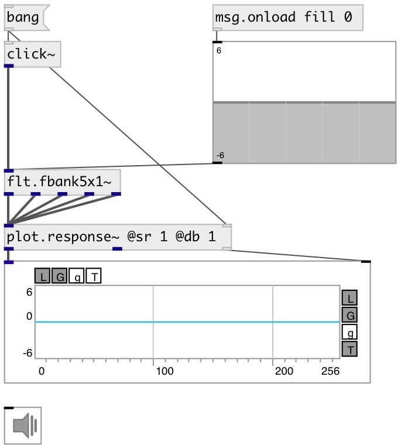

[index](index.html) :: [flt](category_flt.html)
---

# flt.fbank5x1~

###### 5 band one octave butterworth filterbank

*доступно с версии:* 0.9.2

---

## информация
Split the input signal into a bank of parallel signals, one for each spectral band Contains: lowpass, 3 bandbass and highpass filter A Filter-Bank is a signal bandsplitter having the property that summing its output signals gives an allpass-filtered version of the filter-bank input signal. A more conventional term for this is an &#34;allpass-complementary filter bank&#34;

## аргументы:

* **F250**
@f250 property init value 
_тип:_ float 
_единица:_ db 

* **F500**
@f500 property init value 
_тип:_ float 
_единица:_ db 

* **F1000**
@f1000 property init value 
_тип:_ float 
_единица:_ db 

* **F2000**
@f2000 property init value 
_тип:_ float 
_единица:_ db 

* **F4000**
@f4000 property init value 
_тип:_ float 
_единица:_ db 

## методы:

* **reset**
reset filter state 

## свойства:

* **@f250** 
Запросить/установить first filter (lowpass) gain at 250Hz 
_тип:_ float 
_единица:_ db 
_диапазон:_ -6..6 
_по умолчанию:_ 0 

* **@f500** 
Запросить/установить second filter (bandpass) gain at 500Hz 
_тип:_ float 
_единица:_ db 
_диапазон:_ -6..6 
_по умолчанию:_ 0 

* **@f1000** 
Запросить/установить third filter (bandpass) gain at 1000Hz 
_тип:_ float 
_единица:_ db 
_диапазон:_ -6..6 
_по умолчанию:_ 0 

* **@f2000** 
Запросить/установить fourth filter (bandpass) gain at 2000Hz 
_тип:_ float 
_единица:_ db 
_диапазон:_ -6..6 
_по умолчанию:_ 0 

* **@f4000** 
Запросить/установить fifth filter (highpass) gain at 4000Hz 
_тип:_ float 
_единица:_ db 
_диапазон:_ -6..6 
_по умолчанию:_ 0 

* **@active** 
Запросить/установить on/off dsp processing 
_тип:_ bool 
_по умолчанию:_ 1 

## входы:

* input signal 
_тип:_ audio

## выходы:

* lpf: 250Hz 
_тип:_ audio
* bpf: 500Hz 
_тип:_ audio
* bpf: 1000Hz 
_тип:_ audio
* bpf: 2000Hz 
_тип:_ audio
* hpf: 4000Hz 
_тип:_ audio

## ключевые слова:

[filter](keywords/filter.html)
[filterbank](keywords/filterbank.html)

**Авторы:** Serge Poltavsky

**Лицензия:** GPL3 or later

