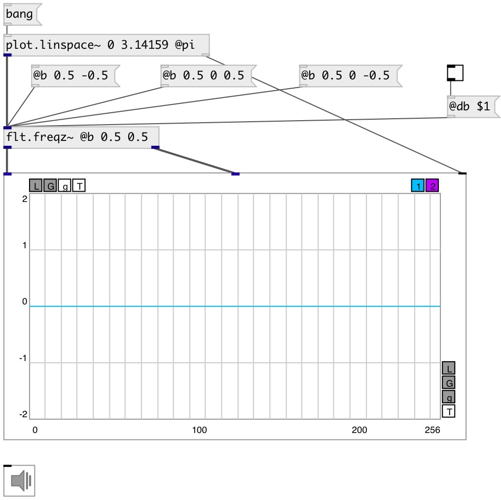

[index](index.html) :: [flt](category_flt.html)
---

# flt.freqz~

###### compute the frequency response of a digital filter

*доступно с версии:* 0.9

---

## информация
Given the M-order numerator b and N-order denominator a of a digital filter, compute its frequency response: H(eʲʷ) = B(eʲʷ)/A(eʲʷ) = (b⁰+b¹e⁻ʲʷ+...+bᴹe⁻ʲʷᴹ)/(1+a¹e⁻ʲʷ+...+aᴺe⁻ʲʷᴺ)

## свойства:

* **@a** 
Получить/установить denominator (poles) coefficients. &#39;a0&#39; always implicitly set to 1, property
value set a1...an coefficients 
_тип:_ list 

* **@b** 
Получить/установить numerator (zeros) coefficients 
_тип:_ list 
_по умолчанию:_ 1 

* **@sr** 
Получить/установить normalize using current samplerate 
_тип:_ int 
_варианты:_ 0, 1 
_по умолчанию:_ 0 

* **@db** 
Получить/установить output amp response in db scale 
_тип:_ int 
_варианты:_ 0, 1 
_по умолчанию:_ 0 

## входы:

* input frequency in radians [0, π] or in hertz [0 sr/2] if @sr property is true 
_тип:_ audio

## выходы:

* amplitude frequency response signal 
_тип:_ audio
* phase frequency response signal 
_тип:_ audio

## ключевые слова:

[filter](keywords/filter.html)
[calc](keywords/calc.html)
[bode](keywords/bode.html)
[frequence](keywords/frequence.html)
[response](keywords/response.html)
[phase](keywords/phase.html)
[plot](keywords/plot.html)

**Авторы:** Serge Poltavsky

**Лицензия:** GPL3 or later

