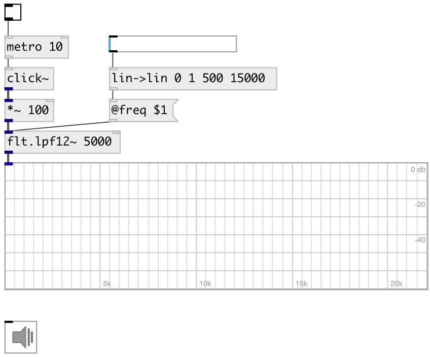

[index](index.html) :: [flt](category_flt.html)
---

# flt.lpf12~

###### Low-pass second order Butterworth filter

*доступно с версии:* 0.1

---

## информация
A low-pass filter is a filter that passes signals with a frequency lower than a certain cutoff frequency and attenuates signals with frequencies higher than the cutoff frequency. A low-pass filter is the complement of a high-pass filter. Butterworth filter is a type of filter designed to have a frequency response as flat as possible in the passband.

## аргументы:

* **FREQ**
cutoff frequency 
_тип:_ float 
_единица:_ Hz 

## методы:

* **reset**
reset filter state 

## свойства:

* **@freq** 
Запросить/установить cutoff frequency 
_тип:_ float 
_единица:_ Hz 
_диапазон:_ 20..20000 
_по умолчанию:_ 1000 

* **@active** 
Запросить/установить on/off dsp processing 
_тип:_ bool 
_по умолчанию:_ 1 

* **@osc** (initonly)
Запросить/установить OSC server name to listen 
_тип:_ symbol 

* **@id** (initonly)
Запросить/установить OSC address id. If specified, bind all properties to /ID/flt_lpf12/PROP_NAME
osc address, if empty bind to /flt_lpf12/PROP_NAME. 
_тип:_ symbol 

## входы:

* input signal 
_тип:_ audio
* set frequency 
_тип:_ control

## выходы:

* filtered signal 
_тип:_ audio

## ключевые слова:

[filter](keywords/filter.html)
[lowpass](keywords/lowpass.html)

**Смотрите также:**
[\[flt.lpf24~\]](flt.lpf24~.html)
[\[flt.hpf12~\]](flt.hpf12~.html)
[\[flt.c_lpf~\]](flt.c_lpf~.html)

**Авторы:** Alex Nadzharov, Serge Poltavsky

**Лицензия:** GPL3 or later

