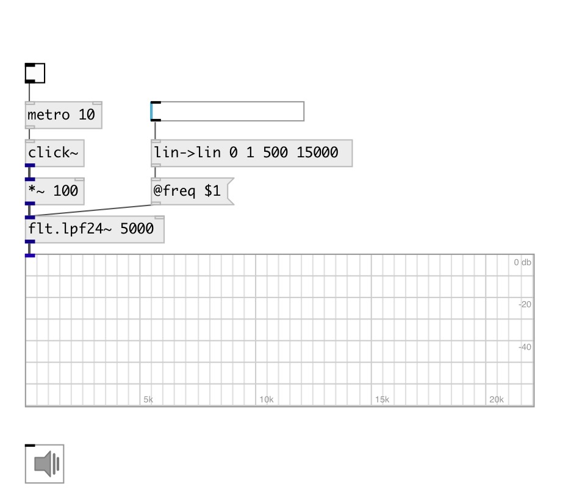

[index](index.html) :: [flt](category_flt.html)
---

# flt.lpf24~

###### Low-pass fourth order Butterworth filter

*доступно с версии:* 0.1

---

## информация
A low-pass filter is a filter that passes signals with a frequency lower than a certain cutoff frequency and attenuates signals with frequencies higher than the cutoff frequency. A low-pass filter is the complement of a high-pass filter. Butterworth filter is a type of filter designed to have a frequency response as flat as possible in the passband.

## аргументы:

* **freq**
cutoff frequency 
_тип:_ float 
_единица:_ Hz 

## свойства:

* **@freq** 
Получить/установить cutoff frequency 
_тип:_ float 
_единица:_ Hz 
_диапазон:_ 20..20000 
_по умолчанию:_ 1000 

* **@active** 
Получить/установить on/off dsp processing 
_тип:_ int 
_варианты:_ 0, 1 
_по умолчанию:_ 1 

## входы:

* input signal 
_тип:_ audio

## выходы:

* filtered signal 
_тип:_ audio

## ключевые слова:

[filter](keywords/filter.html)
[lowpass](keywords/lowpass.html)

**Смотрите также:**
[\[flt.lpf12~\]](flt.lpf12~.html)
[\[flt.hpf12~\]](flt.hpf12~.html)
[\[flt.c_lpf~\]](flt.c_lpf~.html)

**Авторы:** Alex Nadzharov, Serge Poltavsky

**Лицензия:** GPL3 or later

