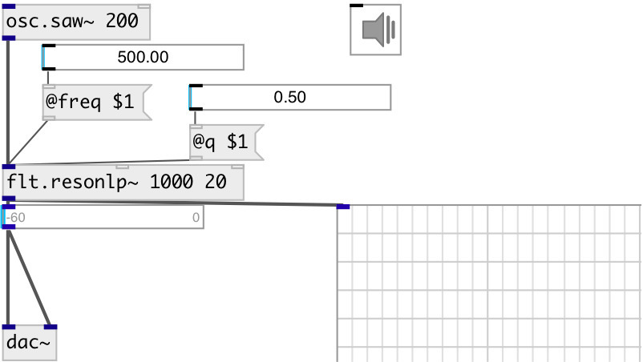

[index](index.html) :: [flt](category_flt.html)
---

# flt.resonlp~

###### Simple resonant lowpass filter

*доступно с версии:* 0.9.6

---

## аргументы:

* **FREQ**
center frequency 
_тип:_ float 
_единица:_ Hz 

* **Q**
Quality factor 
_тип:_ float 

## свойства:

* **@freq** 
Запросить/установить center frequency 
_тип:_ float 
_единица:_ Hz 
_диапазон:_ 20..20000 
_по умолчанию:_ 1000 

* **@q** 
Запросить/установить Quality factor 
_тип:_ float 
_диапазон:_ 0.1..100 
_по умолчанию:_ 40 

* **@active** 
Запросить/установить on/off dsp processing 
_тип:_ bool 
_по умолчанию:_ 1 

## входы:

* input signal 
_тип:_ audio
* set frequency 
_тип:_ control
* set Q-factor 
_тип:_ control

## выходы:

* filtered signal 
_тип:_ audio

## ключевые слова:

[filter](keywords/filter.html)
[resonant](keywords/resonant.html)
[lowpass](keywords/lowpass.html)

**Смотрите также:**
[\[flt.resonbp~\]](flt.resonbp~.html)

**Авторы:** Serge Poltavsky

**Лицензия:** GPL3 or later

