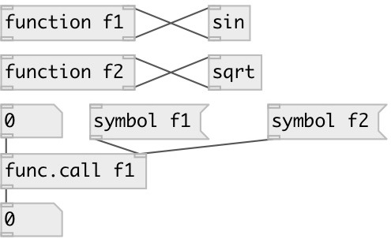

[index](index.html) :: [base](category_base.html)
---

# function.call

###### call named function

*доступно с версии:* 0.3

---

## аргументы:

* **NAME**
function name 
_тип:_ symbol 

## входы:

* input value 
_тип:_ control
* change function name 
_тип:_ control

## выходы:

* function result 
_тип:_ control

## ключевые слова:

[function](keywords/function.html)
[call](keywords/call.html)

**Смотрите также:**
[\[function\]](function.html)

**Авторы:** Serge Poltavsky

**Лицензия:** GPL3 or later

