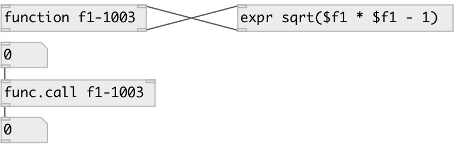

[index](index.html) :: [base](category_base.html)
---

# function

###### named function

*доступно с версии:* 0.3

---

## аргументы:

* **NAME**
function name, should be unique 
_тип:_ symbol 

## входы:

* input value 
_тип:_ control
* value from side-chain 
_тип:_ control

## выходы:

* result value 
_тип:_ control
* value to side-chain 
_тип:_ control

## ключевые слова:

[function](keywords/function.html)

**Смотрите также:**
[\[function.call\]](function.call.html)

**Авторы:** Serge Poltavsky

**Лицензия:** GPL3 or later

