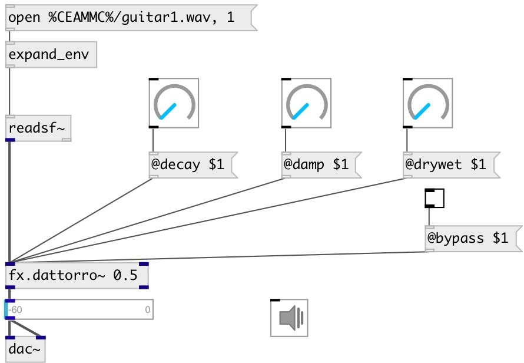

[index](index.html) :: [fx](category_fx.html)
---

# fx.dattorro~

###### dattorro reverb

*доступно с версии:* 0.9.6

---

## информация
Reverberator based on the Dattorro reverb topology with default reverb parameters from the original paper

## аргументы:

* **DECAY**
decay rate, infinite decay = 1.0 
_тип:_ float 

* **DRYWET**
proportion of mix between the original (dry) and &#39;effected&#39; (wet) signals 
_тип:_ float 

## методы:

* **reset**
reset reverb 

## свойства:

* **@decay** 
Запросить/установить decay rate. Infinite decay = 1.0 
_тип:_ float 
_диапазон:_ 0..1 
_по умолчанию:_ 0.5 

* **@damp** 
Запросить/установить high-frequency damping. No damping = 0.0 
_тип:_ float 
_диапазон:_ 0..1 
_по умолчанию:_ 0.0005 

* **@drywet** 
Запросить/установить proportion of mix between the original (dry) and &#39;effected&#39; (wet) signals. 0 -
dry signal, 1 - wet 
_тип:_ float 
_диапазон:_ 0..1 
_по умолчанию:_ 0.33 

* **@predelay** 
Запросить/установить a delay operating on the &#39;wet&#39; signal. Large values will provide the impression
of a larger room 
_тип:_ float 
_единица:_ ms 
_диапазон:_ 0..100 
_по умолчанию:_ 40 

* **@idiff1** 
Запросить/установить input diffusion factor 1 
_тип:_ float 
_диапазон:_ 0..1 
_по умолчанию:_ 0.625 

* **@idiff2** 
Запросить/установить input diffusion factor 2 
_тип:_ float 
_диапазон:_ 0..1 
_по умолчанию:_ 0.75 

* **@bypass** 
Запросить/установить if set to 1 - bypass &#39;effected&#39; signal 
_тип:_ bool 
_по умолчанию:_ 0 

* **@active** 
Запросить/установить on/off dsp processing 
_тип:_ bool 
_по умолчанию:_ 1 

* **@ddiff1** 
Запросить/установить decay diffusion factor 1 
_тип:_ float 
_диапазон:_ 0..1 
_по умолчанию:_ 0.5 

* **@ddiff2** 
Запросить/установить decay diffusion factor 2 
_тип:_ float 
_диапазон:_ 0..1 
_по умолчанию:_ 0.7 

* **@bw** 
Запросить/установить band-width filter (pre filtering) 
_тип:_ float 
_диапазон:_ 0..1 
_по умолчанию:_ 0.9995 

## входы:

* left channel 
_тип:_ audio
* right channel 
_тип:_ audio

## выходы:

* output left 
_тип:_ audio
* output right 
_тип:_ audio

## ключевые слова:

[fx](keywords/fx.html)
[reverb](keywords/reverb.html)

**Авторы:** Serge Poltavsky

**Лицензия:** GPL3 or later

