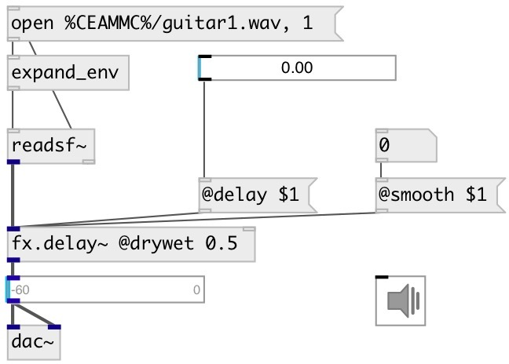

[index](index.html) :: [fx](category_fx.html)
---

# fx.delay~

###### smooth delay with a feedback control

*доступно с версии:* 0.6

---

## информация
delay that doesn&#39;t click and doesn&#39;t transpose when the delay time is changed

## аргументы:

* **DELAY**
delay time 
_тип:_ float 
_единица:_ ms 

* **FEEDBACK**
feedback coefficient 
_тип:_ float 

## методы:

* **reset**
clears delay line 

## свойства:

* **@delay** 
Запросить/установить echo time 
_тип:_ float 
_единица:_ ms 
_диапазон:_ 0..6000 
_по умолчанию:_ 1 

* **@feedback** 
Запросить/установить feedback coefficient 
_тип:_ float 
_диапазон:_ 0..1 
_по умолчанию:_ 0 

* **@filter** 
Запросить/установить if true - apply filter to feedback signal 
_тип:_ bool 
_по умолчанию:_ 0 

* **@f_lpf** 
Запросить/установить feedback low-pass filter cutoff frequency 
_тип:_ float 
_единица:_ Hz 
_диапазон:_ 20..20000 
_по умолчанию:_ 9000 

* **@f_hpf** 
Запросить/установить feedback high-pass filter cutoff frequency 
_тип:_ float 
_единица:_ Hz 
_диапазон:_ 20..20000 
_по умолчанию:_ 300 

* **@compress** 
Запросить/установить feedback compression factor. 0: means no compression, 1: limit feedback level. 
_тип:_ float 
_диапазон:_ 0..1 
_по умолчанию:_ 0.5 

* **@c_thresh** 
Запросить/установить feedback compression threshold level 
_тип:_ float 
_единица:_ db 
_диапазон:_ -60..0 
_по умолчанию:_ 0 

* **@c_attack** 
Запросить/установить feedback compression attack time 
_тип:_ float 
_единица:_ ms 
_диапазон:_ 0.1..100 
_по умолчанию:_ 10 

* **@c_release** 
Запросить/установить feedback compression release time 
_тип:_ float 
_единица:_ ms 
_диапазон:_ 1..500 
_по умолчанию:_ 50 

* **@smooth** 
Запросить/установить interpolation time on delay time change, that prevents click and transpose, if
equal to 0 produces artifacts on delay change 
_тип:_ float 
_единица:_ ms 
_диапазон:_ 0..500 
_по умолчанию:_ 50 

* **@drywet** 
Запросить/установить proportion of mix between the original (dry) and &#39;effected&#39; (wet) signals. 0 -
dry signal, 1 - wet. 
_тип:_ float 
_диапазон:_ 0..1 
_по умолчанию:_ 1 

* **@bypass** 
Запросить/установить bypass flag. If true: bypass &#39;effected&#39; signal. 
_тип:_ bool 
_по умолчанию:_ 0 

* **@osc** (initonly)
Запросить/установить OSC server name to listen 
_тип:_ symbol 

* **@id** (initonly)
Запросить/установить OSC address id. If specified, bind all properties to /ID/fx_delay/PROP_NAME osc
address, if empty bind to /fx_delay/PROP_NAME. 
_тип:_ symbol 

* **@active** 
Запросить/установить on/off dsp processing 
_тип:_ bool 
_по умолчанию:_ 1 

## входы:

* input signal 
_тип:_ audio
* set delay time 
_тип:_ control

## выходы:

* output signal 
_тип:_ audio

## ключевые слова:

[fx](keywords/fx.html)
[echo](keywords/echo.html)
[delay](keywords/delay.html)

**Смотрите также:**
[\[fx.echo~\]](fx.echo~.html)

**Авторы:** Yann Orlarey, Serge Poltavsky

**Лицензия:** GPL3 or later

