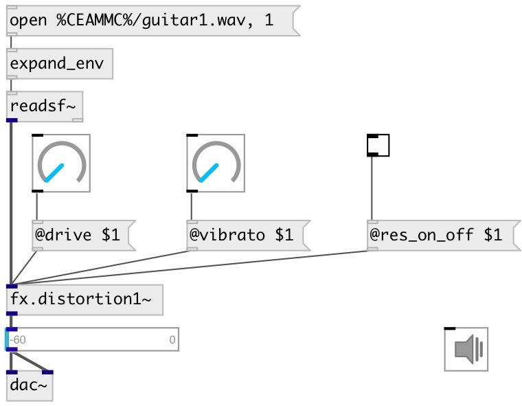

[index](index.html) :: [fx](category_fx.html)
---

# fx.distortion1~

###### distortion #1 from Guitarix effects set

*доступно с версии:* 0.7

---

## свойства:

* **@sp_low_freq** 
Получить/установить speaker emulation low frequency 
_тип:_ float 
_единица:_ Hz 
_диапазон:_ 20..1000 
_по умолчанию:_ 130 

* **@sp_high_freq** 
Получить/установить speaker emulation high frequency 
_тип:_ float 
_единица:_ Hz 
_диапазон:_ 1000..12000 
_по умолчанию:_ 5000 

* **@sp_on_off** 
Получить/установить speaker emulation turn on/off 
_тип:_ int 
_варианты:_ 0, 1 
_по умолчанию:_ 0 

* **@lp_freq** 
Получить/установить low pass frequency 
_тип:_ float 
_единица:_ Hz 
_диапазон:_ 20..12000 
_по умолчанию:_ 5000 

* **@hp_freq** 
Получить/установить high pass frequency 
_тип:_ float 
_единица:_ Hz 
_диапазон:_ 20..7040 
_по умолчанию:_ 130 

* **@flt_on_off** 
Получить/установить filter processing 
_тип:_ int 
_варианты:_ 0, 1 
_по умолчанию:_ 0 

* **@split_low_freq** 
Получить/установить low split frequency 
_тип:_ float 
_единица:_ Hz 
_диапазон:_ 20..600 
_по умолчанию:_ 250 

* **@split_middle_freq** 
Получить/установить middle split frequency 
_тип:_ float 
_единица:_ Hz 
_диапазон:_ 600..1250 
_по умолчанию:_ 650 

* **@split_high_freq** 
Получить/установить high split frequency 
_тип:_ float 
_единица:_ Hz 
_диапазон:_ 1250..12000 
_по умолчанию:_ 1250 

* **@level** 
Получить/установить effect level 
_тип:_ float 
_диапазон:_ 0..0.5 
_по умолчанию:_ 0.01 

* **@gain** 
Получить/установить total effect gain 
_тип:_ float 
_единица:_ db 
_диапазон:_ -10..10 
_по умолчанию:_ 2 

* **@low_gain** 
Получить/установить gain on low frequencies 
_тип:_ float 
_единица:_ db 
_диапазон:_ -10..20 
_по умолчанию:_ 10 

* **@high_gain** 
Получить/установить gain on high frequencies 
_тип:_ float 
_единица:_ db 
_диапазон:_ -10..20 
_по умолчанию:_ 10 

* **@middle_l_gain** 
Получить/установить gain on middle low frequencies 
_тип:_ float 
_единица:_ db 
_диапазон:_ -10..20 
_по умолчанию:_ 10 

* **@middle_h_gain** 
Получить/установить gain on middle high frequencies 
_тип:_ float 
_единица:_ db 
_диапазон:_ -10..20 
_по умолчанию:_ 10 

* **@drive** 
Получить/установить distortion amount 
_тип:_ float 
_диапазон:_ 0..1 
_по умолчанию:_ 0.64 

* **@low_drive** 
Получить/установить distortion amount on low frequencies 
_тип:_ float 
_диапазон:_ 0..1 
_по умолчанию:_ 1 

* **@high_drive** 
Получить/установить distortion amount on high frequencies 
_тип:_ float 
_диапазон:_ 0..1 
_по умолчанию:_ 1 

* **@middle_l_drive** 
Получить/установить distortion amount on middle low frequencies 
_тип:_ float 
_диапазон:_ 0..1 
_по умолчанию:_ 1 

* **@middle_h_drive** 
Получить/установить distortion amount on middle high frequencies 
_тип:_ float 
_диапазон:_ 0..1 
_по умолчанию:_ 1 

* **@res_on_off** 
Получить/установить resonator 
_тип:_ int 
_варианты:_ 0, 1 
_по умолчанию:_ 0 

* **@vibrato** 
Получить/установить resonator vibration 
_тип:_ float 
_диапазон:_ 0..1 
_по умолчанию:_ 1 

* **@trigger** 
Получить/установить resonator trigger 
_тип:_ float 
_диапазон:_ 0..1 
_по умолчанию:_ 0.12 

* **@active** 
Получить/установить on/off dsp processing 
_тип:_ int 
_варианты:_ 0, 1 
_по умолчанию:_ 1 

## входы:

* input signal 
_тип:_ audio

## выходы:

* output signal 
_тип:_ audio

## ключевые слова:

[fx](keywords/fx.html)
[distortion](keywords/distortion.html)

**Смотрите также:**
[\[fx.distortion~\]](fx.distortion~.html)
[\[fx.distortion2~\]](fx.distortion2~.html)
[\[fx.distortion3~\]](fx.distortion3~.html)

**Авторы:** Serge Poltavsky

**Лицензия:** GPL3 or later

