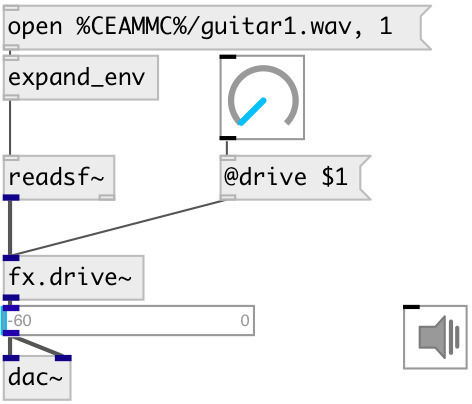

[index](index.html) :: [fx](category_fx.html)
---

# fx.drive~

###### Guitarix drive effect

*доступно с версии:* 0.7

---

## аргументы:

* **DRIVE**
drive coefficient 
_тип:_ float 

## свойства:

* **@drive** 
Получить/установить drive coefficient 
_тип:_ float 
_диапазон:_ 1..10 
_по умолчанию:_ 1 

* **@bypass** 
Получить/установить if set to 1 - bypass &#39;effected&#39; signal. 
_тип:_ int 
_варианты:_ 0, 1 
_по умолчанию:_ 0 

* **@active** 
Получить/установить on/off dsp processing 
_тип:_ int 
_варианты:_ 0, 1 
_по умолчанию:_ 1 

## входы:

* input signal 
_тип:_ audio

## выходы:

* output 
_тип:_ audio

## ключевые слова:

[fx](keywords/fx.html)
[drive](keywords/drive.html)

**Авторы:** Serge Poltavsky

**Лицензия:** GPL3 or later

