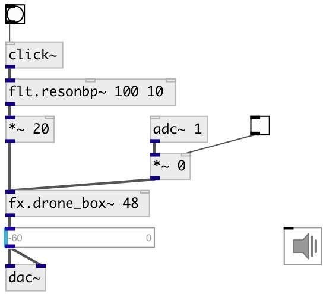

[index](index.html) :: [fx](category_fx.html)
---

# fx.drone_box~

###### mono sympathetic resonance generator

*доступно с версии:* 0.6

---

## аргументы:

* **PITCH**
drone MIDI pitch 
_тип:_ float 

## свойства:

* **@pitch** 
Запросить/установить drone MIDI pitch 
_тип:_ float 
_диапазон:_ 36..60 
_по умолчанию:_ 48 

* **@decay** 
Запросить/установить drone pluck decay time 
_тип:_ float 
_единица:_ ms 
_диапазон:_ 100..120000 
_по умолчанию:_ 4000 

* **@drywet** 
Запросить/установить proportion of mix between the original (dry) and &#39;effected&#39; (wet) signals. 0 -
dry signal, 1 - wet. 
_тип:_ float 
_диапазон:_ 0..1 
_по умолчанию:_ 0.5 

* **@bypass** 
Запросить/установить if set to 1 - bypass &#39;effected&#39; signal. 
_тип:_ bool 
_по умолчанию:_ 0 

* **@active** 
Запросить/установить on/off dsp processing 
_тип:_ bool 
_по умолчанию:_ 1 

## входы:

* input signal 
_тип:_ audio

## выходы:

* output signal 
_тип:_ audio

## ключевые слова:

[fx](keywords/fx.html)
[drone](keywords/drone.html)

**Авторы:** Oliver Larkin, Serge Poltavsky

**Лицензия:** GPL3 or later

