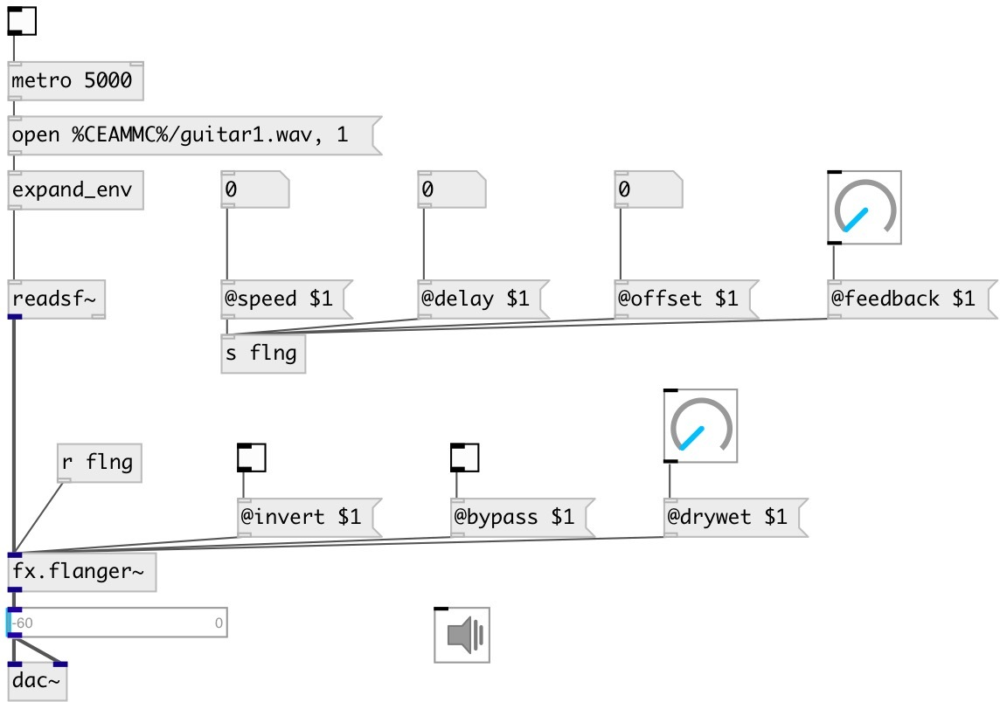

[index](index.html) :: [fx](category_fx.html)
---

# fx.flanger~

###### mono flanging effect

*доступно с версии:* 0.2

---

## методы:

* **reset**
reset object 

## свойства:

* **@delay** 
Запросить/установить flange delay 
_тип:_ float 
_единица:_ ms 
_диапазон:_ 0..20 
_по умолчанию:_ 10 

* **@offset** 
Запросить/установить flange delay offset 
_тип:_ float 
_единица:_ ms 
_диапазон:_ 0..20 
_по умолчанию:_ 1 

* **@speed** 
Запросить/установить flanger frequency 
_тип:_ float 
_единица:_ Hz 
_диапазон:_ 0..10 
_по умолчанию:_ 0.5 

* **@feedback** 
Запросить/установить feedback gain 
_тип:_ float 
_диапазон:_ 0..1 
_по умолчанию:_ 0 

* **@invert** 
Запросить/установить 0 for normal, 1 to invert sign of flanging sum 
_тип:_ bool 
_по умолчанию:_ 0 

* **@drywet** 
Запросить/установить proportion of mix between the original (dry) and &#39;effected&#39; (wet) signals. 0 -
dry signal, 1 - wet. 
_тип:_ float 
_диапазон:_ 0..1 
_по умолчанию:_ 1 

* **@bypass** 
Запросить/установить bypass flag. If true: bypass &#39;effected&#39; signal. 
_тип:_ bool 
_по умолчанию:_ 0 

* **@active** 
Запросить/установить on/off dsp processing 
_тип:_ bool 
_по умолчанию:_ 1 

* **@osc** (initonly)
Запросить/установить OSC server name to listen 
_тип:_ symbol 

* **@id** (initonly)
Запросить/установить OSC address id. If specified, bind all properties to /ID/fx_flanger/PROP_NAME
osc address, if empty bind to /fx_flanger/PROP_NAME. 
_тип:_ symbol 

## входы:

* input signal 
_тип:_ audio

## выходы:

* output signal 
_тип:_ audio

## ключевые слова:

[fx](keywords/fx.html)
[flanger](keywords/flanger.html)

**Авторы:** Serge Poltavsky

**Лицензия:** GPL3 or later

