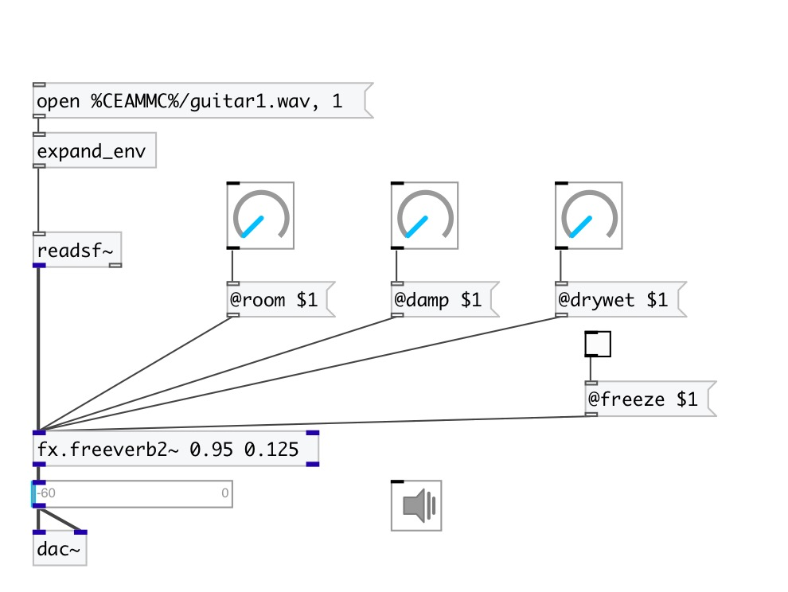

[index](index.html) :: [fx](category_fx.html)
---

# fx.freeverb2~

###### freeverb2 - stereo version of freeverb

*доступно с версии:* 0.2

---

## информация
A simple Schroeder reverberator primarily developed by &#34;Jezar at Dreampoint&#34; that is extensively used in the free-software world. It uses four Schroeder allpasses in series and eight parallel Schroeder-Moorer filtered-feedback comb-filters for each audio channel, and is said to be especially well tuned.

## аргументы:

* **ROOM**
room size 
_тип:_ float 

* **DRYWET**
proportion of mix between the original (dry) and &#39;effected&#39; (wet) signals 
_тип:_ float 

## методы:

* **reset**
reset reverb 

## свойства:

* **@room** 
Получить/установить room size 
_тип:_ float 
_диапазон:_ 0..1 
_по умолчанию:_ 0.5 

* **@damp** 
Получить/установить damping of the lowpass comb filter 
_тип:_ float 
_диапазон:_ 0..1 
_по умолчанию:_ 0.5 

* **@drywet** 
Получить/установить proportion of mix between the original (dry) and &#39;effected&#39; (wet) signals. 0 -
dry signal, 1 - wet 
_тип:_ float 
_диапазон:_ 0..1 
_по умолчанию:_ 0.33 

* **@spread** 
Получить/установить spatial spread between 0 and 1 with 1 for maximum spread 
_тип:_ float 
_диапазон:_ 0..1 
_по умолчанию:_ 0.5 

* **@bypass** 
Получить/установить if set to 1 - bypass &#39;effected&#39; signal 
_тип:_ int 
_варианты:_ 0, 1 
_по умолчанию:_ 0 

* **@active** 
Получить/установить on/off dsp processing 
_тип:_ int 
_варианты:_ 0, 1 
_по умолчанию:_ 1 

* **@freeze** 
Получить/установить freeze reverberation tail 
_тип:_ int 
_варианты:_ 0, 1 
_по умолчанию:_ 0 

* **@fr_room** 
Получить/установить freeze room size 
_тип:_ float 
_диапазон:_ 0..1 
_по умолчанию:_ 0.999 

* **@fr_damp** 
Получить/установить freeze room damp 
_тип:_ float 
_диапазон:_ 0..1 
_по умолчанию:_ 0.0001 

* **@fr_time** 
Получить/установить length of freeze tail 
_тип:_ float 
_единица:_ ms 
_диапазон:_ 0..1000 
_по умолчанию:_ 100 

## входы:

* left channel 
_тип:_ audio
* right channel 
_тип:_ audio

## выходы:

* output left 
_тип:_ audio
* output right 
_тип:_ audio

## ключевые слова:

[fx](keywords/fx.html)
[reverb](keywords/reverb.html)

**Авторы:** Serge Poltavsky

**Лицензия:** GPL3 or later

