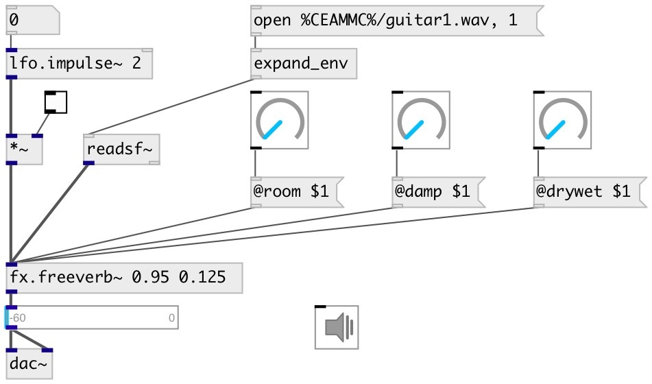

[index](index.html) :: [fx](category_fx.html)
---

# fx.freeverb~

###### freeverb - common used open-source reverb

*доступно с версии:* 0.2

---

## информация
A simple Schroeder reverberator primarily developed by &#34;Jezar at Dreampoint&#34; that is extensively used in the free-software world. It uses four Schroeder allpasses in series and eight parallel Schroeder-Moorer filtered-feedback comb-filters for each audio channel, and is said to be especially well tuned.

## аргументы:

* **ROOM**
room size 
_тип:_ float 

* **DRYWET**
proportion of mix between the original (dry) and &#39;effected&#39; (wet) signals 
_тип:_ float 

## методы:

* **reset**
reset reverb 

## свойства:

* **@room** 
Запросить/установить room size 
_тип:_ float 
_диапазон:_ 0..1 
_по умолчанию:_ 0.5 

* **@damp** 
Запросить/установить damping of the lowpass comb filter 
_тип:_ float 
_диапазон:_ 0..1 
_по умолчанию:_ 0.5 

* **@drywet** 
Запросить/установить proportion of mix between the original (dry) and &#39;effected&#39; (wet) signals. 0 -
dry signal, 1 - wet 
_тип:_ float 
_диапазон:_ 0..1 
_по умолчанию:_ 0.33 

* **@bypass** 
Запросить/установить bypass flag. If true: bypass &#39;effected&#39; signal. 
_тип:_ bool 
_по умолчанию:_ 0 

* **@active** 
Запросить/установить on/off dsp processing 
_тип:_ bool 
_по умолчанию:_ 1 

* **@freeze** 
Запросить/установить freeze reverberation tail 
_тип:_ bool 
_по умолчанию:_ 0 

* **@fr_room** 
Запросить/установить freeze room size 
_тип:_ float 
_диапазон:_ 0..1 
_по умолчанию:_ 0.999 

* **@fr_damp** 
Запросить/установить freeze room damp 
_тип:_ float 
_диапазон:_ 0..1 
_по умолчанию:_ 0.0001 

* **@fr_time** 
Запросить/установить length of freeze tail 
_тип:_ float 
_единица:_ ms 
_диапазон:_ 0..1000 
_по умолчанию:_ 100 

* **@osc** (initonly)
Запросить/установить OSC server name to listen 
_тип:_ symbol 

* **@id** (initonly)
Запросить/установить OSC address id. If specified, bind all properties to /ID/fx_freeverb/PROP_NAME
osc address, if empty bind to /fx_freeverb/PROP_NAME. 
_тип:_ symbol 

## входы:

* input signal 
_тип:_ audio

## выходы:

* output signal 
_тип:_ audio

## ключевые слова:

[fx](keywords/fx.html)
[reverb](keywords/reverb.html)

**Смотрите также:**
[\[fx.freeverb2~\]](fx.freeverb2~.html)

**Авторы:** Serge Poltavsky

**Лицензия:** GPL3 or later

