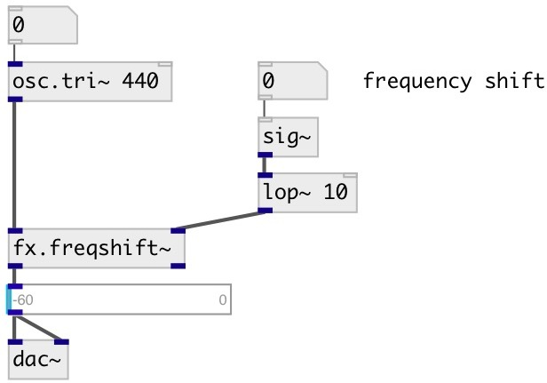

[index](index.html) :: [fx](category_fx.html)
---

# fx.freqshift~

###### frequency shifter or single-sideband ring modulation

*доступно с версии:* 0.1

---

## свойства:

* **@active** 
Получить/установить on/off dsp processing 
_тип:_ int 
_варианты:_ 0, 1 
_по умолчанию:_ 1 

## входы:

* input signal 
_тип:_ audio
* frequency shift in Hertz 
_тип:_ audio

## выходы:

* output signal (freq + shift) 
_тип:_ audio
* output signal (freq - shift) 
_тип:_ audio

## ключевые слова:

[fx](keywords/fx.html)
[freqshift](keywords/freqshift.html)

**Авторы:** Alex Nadzharov, Serge Poltavsky

**Лицензия:** GPL3 or later

