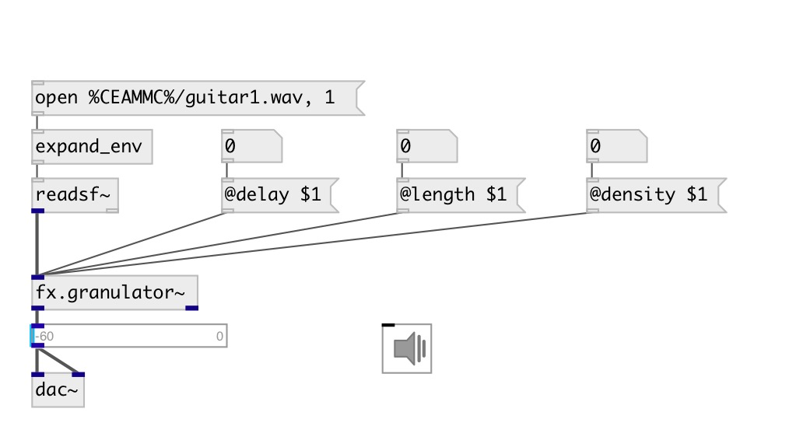

[index](index.html) :: [fx](category_fx.html)
---

# fx.granulator~

###### simple input stream granulator

*доступно с версии:* 0.7

---

## информация
The granulator contains two lines: A and B Input buffer size: ~3 seconds

## методы:

* **reset**
reset object state 

## свойства:

* **@osc** (initonly)
Запросить/установить OSC server name to listen 
_тип:_ symbol 

* **@id** (initonly)
Запросить/установить OSC address id. If specified, bind all properties to
/ID/fx_granulator/PROP_NAME osc address, if empty bind to
/fx_granulator/PROP_NAME. 
_тип:_ symbol 

* **@active** 
Запросить/установить on/off the dsp processing 
_тип:_ bool 
_по умолчанию:_ 1 

* **@delay** 
Запросить/установить grain delay 
_тип:_ float 
_единица:_ ms 
_диапазон:_ 500..3000 
_по умолчанию:_ 3000 

* **@density** 
Запросить/установить number of grains 
_тип:_ float 
_диапазон:_ 1.0..16.0 
_по умолчанию:_ 1.0 

* **@gainAL** 
Запросить/установить A-channel left output gain 
_тип:_ float 
_диапазон:_ 0.0..1.0 
_по умолчанию:_ 0.75 

* **@gainAR** 
Запросить/установить A-channel right ouptut gain 
_тип:_ float 
_диапазон:_ 0.0..1.0 
_по умолчанию:_ 0.25 

* **@gainBL** 
Запросить/установить B-channel left output gain 
_тип:_ float 
_диапазон:_ 0.0..1.0 
_по умолчанию:_ 0.25 

* **@gainBR** 
Запросить/установить B-channel right output gain 
_тип:_ float 
_диапазон:_ 0.0..1.0 
_по умолчанию:_ 0.75 

* **@hpfA** 
Запросить/установить A-channel HPF corner frequency 
_тип:_ float 
_единица:_ Hz 
_диапазон:_ 50.0..10000.0 
_по умолчанию:_ 100.0 

* **@hpfB** 
Запросить/установить B-channel HPF corner frequency 
_тип:_ float 
_единица:_ Hz 
_диапазон:_ 50.0..10000.0 
_по умолчанию:_ 100.0 

* **@pitchA** 
Запросить/установить A-channel pitch shift 
_тип:_ float 
_диапазон:_ -4.0..4.0 
_по умолчанию:_ 1.0 

* **@pitchB** 
Запросить/установить B-channel pitchshift 
_тип:_ float 
_диапазон:_ -4.0..4.0 
_по умолчанию:_ 1.0 

* **@size** 
Запросить/установить grain size for both lines 
_тип:_ float 
_единица:_ ms 
_диапазон:_ 10..1000 
_по умолчанию:_ 100 

* **@spread** 
Запросить/установить grain spread in the input buffer 
_тип:_ float 
_диапазон:_ 0.05..1.0 
_по умолчанию:_ 0.5 

## входы:

* input signal 
_тип:_ audio

## выходы:

* left output 
_тип:_ audio
* right output 
_тип:_ audio

## ключевые слова:

[fx](keywords/fx.html)
[bits](keywords/bits.html)
[granulator](keywords/granulator.html)

**Авторы:** Lukas Hartmann, Luca Hilbrich, Serge Poltavsky

**Лицензия:** GPL3 or later

