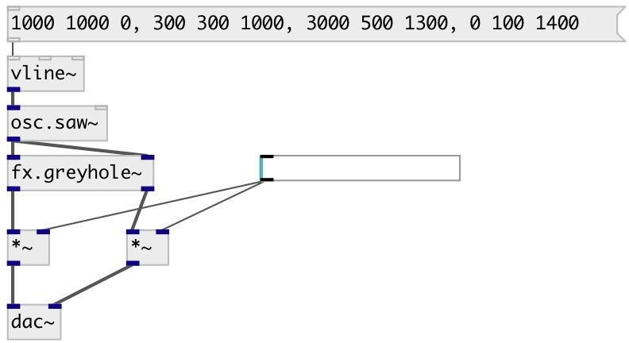

[index](index.html) :: [fx](category_fx.html)
---

# fx.greyhole~

###### A complex echo-like effect

*доступно с версии:* 0.5

---

## информация
A complex echo-like effect, inspired by the classic Eventide effect of a similar name. The effect consists of a diffuser (like a mini-reverb, structurally similar to the one used in JPverb) connected in a feedback system with a long, modulated delay-line. Excels at producing spacey washes of sound. Developed as part of the DEIND project.

## методы:

* **reset**
reset to initial state 

## свойства:

* **@feedback** 
Запросить/установить amount of feedback for the delay line 
_тип:_ float 
_диапазон:_ 0..1 
_по умолчанию:_ 0.9 

* **@damping** 
Запросить/установить controls damping of high-frequencies as the delay decays. 0 is no damping, 1 is
very strong damping 
_тип:_ float 
_диапазон:_ 0..0.99 
_по умолчанию:_ 0 

* **@delaytime** 
Запросить/установить approximate delay time in seconds 
_тип:_ float 
_единица:_ sec 
_диапазон:_ 0.001..1.45 
_по умолчанию:_ 0.2 

* **@diffusion** 
Запросить/установить shape of the diffusion unit. Values greater than 0.707 produce smooth
exponential decay. Lower values produce a slower build-up of echoes 
_тип:_ float 
_диапазон:_ 0..0.99 
_по умолчанию:_ 0.5 

* **@moddepth** 
Запросить/установить depth of delay-line modulation. Use in combination with *@modfreq* to set
amount of chorusing within the structure 
_тип:_ float 
_диапазон:_ 0..1 
_по умолчанию:_ 0.1 

* **@modfreq** 
Запросить/установить frequency of delay-line modulation. Use in combination with *@moddepth* to set
amount of chorusing within the structure 
_тип:_ float 
_диапазон:_ 0..10 
_по умолчанию:_ 2 

* **@size** 
Запросить/установить size of delay-lines within the diffusion unit, producing the impression of a
larger or smaller space. Values below 1 can sound quite metallic. 
_тип:_ float 
_диапазон:_ 0.5..3 
_по умолчанию:_ 1 

* **@drywet** 
Запросить/установить proportion of mix between the original (dry) and &#39;effected&#39; (wet) signals. 0 -
dry signal, 1 - wet. 
_тип:_ float 
_диапазон:_ 0..1 
_по умолчанию:_ 1 

* **@bypass** 
Запросить/установить bypass flag. If true: bypass &#39;effected&#39; signal. 
_тип:_ bool 
_по умолчанию:_ 0 

* **@active** 
Запросить/установить on/off dsp processing 
_тип:_ bool 
_по умолчанию:_ 1 

* **@osc** (initonly)
Запросить/установить OSC server name to listen 
_тип:_ symbol 

* **@id** (initonly)
Запросить/установить OSC address id. If specified, bind all properties to /ID/fx_greyhole/PROP_NAME
osc address, if empty bind to /fx_greyhole/PROP_NAME. 
_тип:_ symbol 

## входы:

* left channel 
_тип:_ audio
* right channel 
_тип:_ audio

## выходы:

* output signal 
_тип:_ audio
* output signal 
_тип:_ audio

## ключевые слова:

[fx](keywords/fx.html)
[reverb](keywords/reverb.html)
[echo](keywords/echo.html)

**Смотрите также:**
[\[fx.freeverb2~\]](fx.freeverb2~.html)

**Авторы:** Julian Parker, Till Bovermann, Serge Poltavsky

**Лицензия:** GPL3 or later

