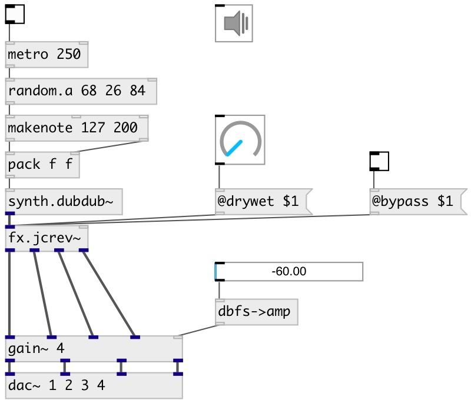

[index](index.html) :: [fx](category_fx.html)
---

# fx.jcrev~

###### Schroeder quad reverberator from 1972

*доступно с версии:* 0.9.6

---

## аргументы:

* **DRYWET**
drywet mix 
_тип:_ float 

## методы:

* **reset**
reset to initial state 

## свойства:

* **@drywet** 
Запросить/установить proportion of mix between the original (dry) and &#39;effected&#39; (wet) signals. 0 -
dry signal, 1 - wet 
_тип:_ float 
_диапазон:_ 0..1 
_по умолчанию:_ 0.4 

* **@bypass** 
Запросить/установить if set to 1 - bypass &#39;effected&#39; signal 
_тип:_ bool 
_по умолчанию:_ 0 

* **@active** 
Запросить/установить on/off dsp processing 
_тип:_ bool 
_по умолчанию:_ 1 

## входы:

* input signal 
_тип:_ audio
* set drywet 
_тип:_ control

## выходы:

* first output signal 
_тип:_ audio
* second output signal 
_тип:_ audio
* third output signal 
_тип:_ audio
* fourth output signal 
_тип:_ audio

## ключевые слова:

[fx](keywords/fx.html)
[room](keywords/room.html)
[reverb](keywords/reverb.html)
[schroeder](keywords/schroeder.html)

**Авторы:** Serge Poltavsky

**Лицензия:** GPL3 or later

