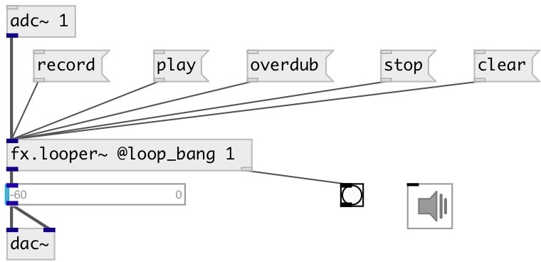

[index](index.html) :: [fx](category_fx.html)
---

# fx.looper~

###### One track looper

*доступно с версии:* 0.5

---

## аргументы:

* **MAX_LENGTH**
max loop time 
_тип:_ float 
_единица:_ sec 

## методы:

* **record**
start loop record 

* **rec**
same as record 

* **adjust**
increase loop length 
  __параметры:__
  - **[DELTA]** loop length delta 
    тип: float  
    единица: samp  

* **play**
play recorded or stopped loop 

* **overdub**
start loop overdubbing while keeping it playing 

* **stop**
stop played loop 

* **pause**
loop pause 

* **clear**
clear loop data and stops playing 

* **smooth**
 
  __параметры:__
  - **[TIME]** apply linear fadein/fadeout to loop 
    тип: float  
    единица: ms  

## свойства:

* **@capacity** 
Получить/установить max loop time 
_тип:_ float 
_единица:_ sec 
_диапазон:_ 0..120 
_по умолчанию:_ 5 

* **@length** (readonly)
Получить recorded loop length 
_тип:_ float 
_единица:_ sec 
_минимальное значение:_ 0 
_по умолчанию:_ 0 

* **@array** 
Получить/установить use specified array for record instead of internal buffer 
_тип:_ symbol 

* **@play_pos** (readonly)
Получить current playing position 
_тип:_ float 
_единица:_ sec 
_минимальное значение:_ 0 
_по умолчанию:_ 0 

* **@play_phase** (readonly)
Получить current playing phase position 
_тип:_ float 
_диапазон:_ 0..1 
_по умолчанию:_ 0 

* **@state** (readonly)
Получить current state 
_тип:_ symbol 
_варианты:_ init, stop, record, play, overdub 
_по умолчанию:_ init 

* **@loop_bang** 
Получить/установить output bang on each loop start 
_тип:_ int 
_варианты:_ 0, 1 
_по умолчанию:_ 1 

* **@loop_smooth** 
Получить/установить time of lin fadein/fadeout applied to recorded loop for smooth playing 
_тип:_ float 
_единица:_ ms 
_минимальное значение:_ 0 
_по умолчанию:_ 10 

* **@play_to_stop_time** 
Получить/установить fadeout time while transition from play to stop 
_тип:_ float 
_единица:_ ms 
_минимальное значение:_ 0 
_по умолчанию:_ 10 

* **@play_to_dub_time** 
Получить/установить fadein time of overdub input signal while transition from play mode 
_тип:_ float 
_единица:_ ms 
_минимальное значение:_ 0 
_по умолчанию:_ 10 

* **@rec_to_play_time** 
Получить/установить xfade between recorded and input signal while transition from record to play 
_тип:_ float 
_единица:_ ms 
_минимальное значение:_ 0 
_по умолчанию:_ 30 

* **@dub_to_stop_time** 
Получить/установить fadeout time while transition from overdub to stop 
_тип:_ float 
_единица:_ ms 
_минимальное значение:_ 0 
_по умолчанию:_ 20 

* **@dub_to_play_time** 
Получить/установить record fadeout time while transition from overdub to play 
_тип:_ float 
_единица:_ ms 
_минимальное значение:_ 0 
_по умолчанию:_ 20 

* **@stop_to_play_time** 
Получить/установить fadein time of play while transition from stop 
_тип:_ float 
_единица:_ ms 
_минимальное значение:_ 0 
_по умолчанию:_ 10 

* **@round** 
Получить/установить encrease loop length to be multiple of specified value. If *0* - no rounding is
performed 
_тип:_ int 
_единица:_ samp 
_минимальное значение:_ 0 
_по умолчанию:_ 0 

## входы:

* input signal 
_тип:_ audio

## выходы:

* output signal 
_тип:_ audio
* bang on each loop start if @loop_bang property is true 
_тип:_ control

## ключевые слова:

[fx](keywords/fx.html)
[looper](keywords/looper.html)

**Авторы:** Serge Poltavsky

**Лицензия:** GPL3 or later

