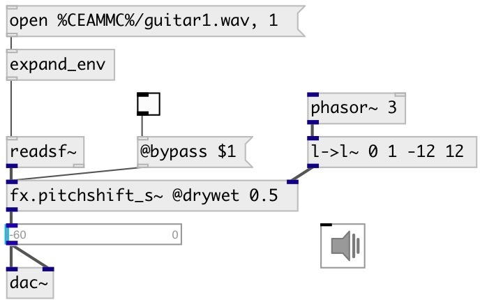

[index](index.html) :: [fx](category_fx.html)
---

# fx.pitchshift_s~

###### signal version of fx.pitchshift~

*доступно с версии:* 0.9

---

## методы:

* **reset**
reset object state 

## свойства:

* **@window** 
Получить/установить the window size 
_тип:_ float 
_единица:_ ms 
_диапазон:_ 10..2000 
_по умолчанию:_ 200 

* **@fade** 
Получить/установить crossfade duration 
_тип:_ float 
_единица:_ ms 
_диапазон:_ 0..1000 
_по умолчанию:_ 100 

* **@drywet** 
Получить/установить proportion of mix between the original (dry) and &#39;effected&#39; (wet) signals. 0 -
dry signal, 1 - wet. 
_тип:_ float 
_диапазон:_ 0..1 
_по умолчанию:_ 1 

* **@bypass** 
Получить/установить if set to 1 - bypass &#39;effected&#39; signal. 
_тип:_ int 
_варианты:_ 0, 1 
_по умолчанию:_ 0 

* **@active** 
Получить/установить on/off dsp processing 
_тип:_ int 
_варианты:_ 0, 1 
_по умолчанию:_ 1 

## входы:

* input signal 
_тип:_ audio
* pitch shift in semitones 
_тип:_ audio

## выходы:

* output signal 
_тип:_ audio

## ключевые слова:

[fx](keywords/fx.html)
[pitchshift](keywords/pitchshift.html)

**Авторы:** Alex Nadzharov, Serge Poltavsky

**Лицензия:** GPL3 or later

