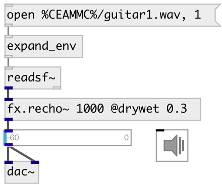

[index](index.html) :: [fx](category_fx.html)
---

# fx.recho~

###### reversed echo effect

*доступно с версии:* 0.9.4

---

## аргументы:

* **time**
echo time 
_тип:_ float 
_единица:_ ms 

* **feedback**
feedback coefficient 
_тип:_ float 

## методы:

* **reset**
reset to initial state 

## свойства:

* **@delay** 
Получить/установить echo time 
_тип:_ float 
_единица:_ ms 
_диапазон:_ 0..2000 
_по умолчанию:_ 500 

* **@feedback** 
Получить/установить feedback coefficient 
_тип:_ float 
_диапазон:_ 0..0.99 
_по умолчанию:_ 0.3 

* **@drywet** 
Получить/установить proportion of mix between the original (dry) and &#39;effected&#39; (wet) signals. 0 -
dry signal, 1 - wet 
_тип:_ float 
_диапазон:_ 0..1 
_по умолчанию:_ 1 

* **@bypass** 
Получить/установить if set to 1 - bypass &#39;effected&#39; signal 
_тип:_ int 
_варианты:_ 0, 1 
_по умолчанию:_ 0 

* **@active** 
Получить/установить on/off dsp processing 
_тип:_ int 
_варианты:_ 0, 1 
_по умолчанию:_ 1 

## входы:

* input signal 
_тип:_ audio

## выходы:

* output signal 
_тип:_ audio

## ключевые слова:

[fx](keywords/fx.html)
[echo](keywords/echo.html)
[reversed](keywords/reversed.html)

**Смотрите также:**
[\[fx.echo~\]](fx.echo~.html)

**Авторы:** Serge Poltavsky

**Лицензия:** GPL3 or later

