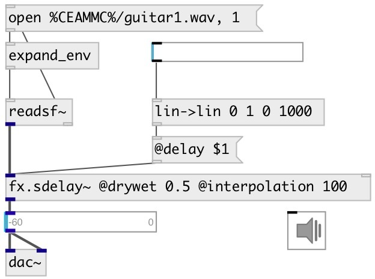

[index](index.html) :: [fx](category_fx.html)
---

# fx.sdelay~

###### smooth delay with a feedback control

*доступно с версии:* 0.6

---

## информация
delay that doesn&#39;t click and doesn&#39;t transpose when the delay time is changed

## аргументы:

* **DELAY**
delay time 
_тип:_ float 
_единица:_ ms 

* **FEEDBACK**
feedback coefficient 
_тип:_ float 

## методы:

* **clear**
clears delay line 

* **reset**
same as reset 

## свойства:

* **@delay** 
Запросить/установить echo time 
_тип:_ float 
_единица:_ ms 
_диапазон:_ 0..6000 
_по умолчанию:_ 1 

* **@feedback** 
Запросить/установить feedback coefficient 
_тип:_ float 
_диапазон:_ 0..1 
_по умолчанию:_ 0 

* **@interpolation** 
Запросить/установить interpolation time 
_тип:_ float 
_единица:_ ms 
_диапазон:_ 1..200 
_по умолчанию:_ 20 

* **@drywet** 
Запросить/установить proportion of mix between the original (dry) and &#39;effected&#39; (wet) signals. 0 -
dry signal, 1 - wet. 
_тип:_ float 
_диапазон:_ 0..1 
_по умолчанию:_ 1 

* **@bypass** 
Запросить/установить if set to 1 - bypass &#39;effected&#39; signal. 
_тип:_ bool 
_по умолчанию:_ 0 

* **@active** 
Запросить/установить on/off dsp processing 
_тип:_ bool 
_по умолчанию:_ 1 

## входы:

* input signal 
_тип:_ audio

## выходы:

* output signal 
_тип:_ audio

## ключевые слова:

[fx](keywords/fx.html)
[echo](keywords/echo.html)
[delay](keywords/delay.html)

**Смотрите также:**
[\[fx.echo~\]](fx.echo~.html)

**Авторы:** Yann Orlarey, Serge Poltavsky

**Лицензия:** GPL3 or later

