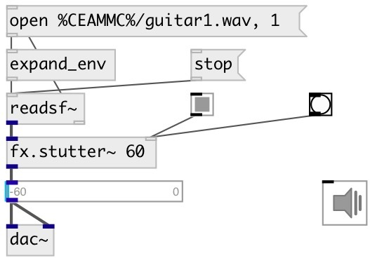

[index](index.html) :: [fx](category_fx.html)
---

# fx.stutter~

###### stutter effect

*доступно с версии:* 0.9.6

---

## аргументы:

* **T**
stutter period 
_тип:_ float 
_единица:_ ms 

## свойства:

* **@t** 
Запросить/установить stutter period 
_тип:_ float 
_единица:_ ms 
_диапазон:_ 1..1000 
_по умолчанию:_ 50 

* **@maxsize** (initonly)
Запросить/установить max stutter period 
_тип:_ float 
_единица:_ ms 
_диапазон:_ 1..10000 
_по умолчанию:_ 1000 

* **@mode** 
Запросить/установить stutter mode. If &#39;fwd&#39;: play loop fragment forwards, &#39;back&#39;: play loop fragment
backwards, &#39;tri&#39;: play loop fragment in both directions 
_тип:_ symbol 
_варианты:_ fwd, back, tri 
_по умолчанию:_ fwd 

* **@speed** 
Запросить/установить loop fragment playing speed 
_тип:_ float 
_диапазон:_ 0.25..4 
_по умолчанию:_ 1 

* **@env** 
Запросить/установить stutter envelope 
_тип:_ atom 

## входы:

* input signal 
_тип:_ audio
* turn on effect for 3 periods 
_тип:_ control

## выходы:

* output 
_тип:_ audio

## ключевые слова:

[fx](keywords/fx.html)
[stutter](keywords/stutter.html)
[glitch](keywords/glitch.html)

**Авторы:** Serge Poltavsky

**Лицензия:** GPL3 or later

