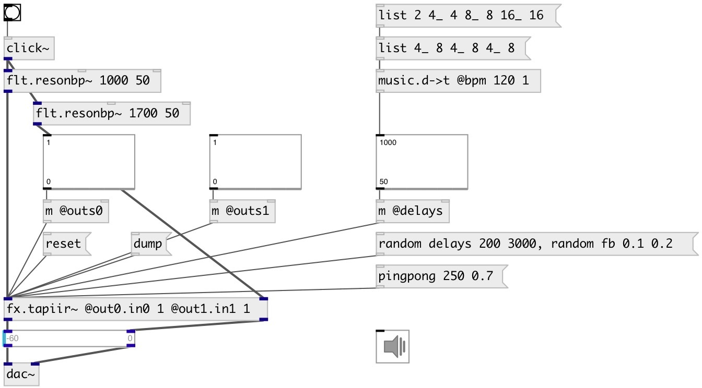

[index](index.html) :: [fx](category_fx.html)
---

# fx.tapiir~

###### multi-tap delay

*доступно с версии:* 0.9.4

---

## методы:

* **pingpong**
set pingpong delay values 
  __параметры:__
  - **DELAY** delay time 
    тип: float  
    единица: ms  
    обязательно: True  

  - **FB** feedback value 
    тип: float  
    обязательно: True  

* **random**
randomize values 
  __параметры:__
  - **TYPE** group name. If &#39;delays&#39; - randomize @delays properties, if &#39;fb&#39; - randomize @fb* properties. 
    тип: symbol  
    обязательно: True  

  - **[MIN]** minimal value 
    тип: float  

  - **[MAX]** maximum value 
    тип: float  

* **reset**
reset to initial state 

## свойства:

* **@delays** 
Запросить/установить list of all tap delays 
_тип:_ list 
_единица:_ ms 
_по умолчанию:_ 0 0 0 0 0 0 

* **@gains** 
Запросить/установить list of all tap gains 
_тип:_ list 
_единица:_ db 
_по умолчанию:_ 0 0 0 0 0 0 

* **@ins0** 
Запросить/установить list of all taps left channel input levels 
_тип:_ list 
_диапазон:_ 0..1 
_по умолчанию:_ 1 1 1 1 1 1 

* **@ins1** 
Запросить/установить list of all taps right channel input levels 
_тип:_ list 
_диапазон:_ 0..1 
_по умолчанию:_ 1 1 1 1 1 1 

* **@outs0** 
Запросить/установить list of all tap output levels to left channel 
_тип:_ list 
_диапазон:_ 0..1 
_по умолчанию:_ 0 0 0 0 0 0 

* **@outs1** 
Запросить/установить list of all tap output levels to right channel 
_тип:_ list 
_диапазон:_ 0..1 
_по умолчанию:_ 0 0 0 0 0 0 

* **@fbs0** 
Запросить/установить list of all feedbacks to tap0 
_тип:_ list 
_диапазон:_ 0..1 
_по умолчанию:_ 0 0 0 0 0 0 

* **@fbs1** 
Запросить/установить list of all feedbacks to tap1 
_тип:_ list 
_диапазон:_ 0..1 
_по умолчанию:_ 0 0 0 0 0 0 

* **@fbs2** 
Запросить/установить list of all feedbacks to tap2 
_тип:_ list 
_диапазон:_ 0..1 
_по умолчанию:_ 0 0 0 0 0 0 

* **@fbs3** 
Запросить/установить list of all feedbacks to tap3 
_тип:_ list 
_диапазон:_ 0..1 
_по умолчанию:_ 0 0 0 0 0 0 

* **@fbs4** 
Запросить/установить list of all feedbacks to tap4 
_тип:_ list 
_диапазон:_ 0..1 
_по умолчанию:_ 0 0 0 0 0 0 

* **@fbs5** 
Запросить/установить list of all feedbacks to tap5 
_тип:_ list 
_диапазон:_ 0..1 
_по умолчанию:_ 0 0 0 0 0 0 

* **@tap0.in0** 
Запросить/установить left input level to tap0 
_тип:_ float 
_диапазон:_ 0..1 
_по умолчанию:_ 1 

* **@tap0.in1** 
Запросить/установить right input level to tap0 
_тип:_ float 
_диапазон:_ 0..1 
_по умолчанию:_ 1 

* **@tap1.in0** 
Запросить/установить left input level to tap1 
_тип:_ float 
_диапазон:_ 0..1 
_по умолчанию:_ 1 

* **@tap1.in1** 
Запросить/установить right input level to tap1 
_тип:_ float 
_диапазон:_ 0..1 
_по умолчанию:_ 1 

* **@tap2.in0** 
Запросить/установить left input level to tap2 
_тип:_ float 
_диапазон:_ 0..1 
_по умолчанию:_ 1 

* **@tap2.in1** 
Запросить/установить right input level to tap2 
_тип:_ float 
_диапазон:_ 0..1 
_по умолчанию:_ 1 

* **@tap3.in0** 
Запросить/установить left input level to tap3 
_тип:_ float 
_диапазон:_ 0..1 
_по умолчанию:_ 1 

* **@tap3.in1** 
Запросить/установить right input level to tap3 
_тип:_ float 
_диапазон:_ 0..1 
_по умолчанию:_ 1 

* **@tap4.in0** 
Запросить/установить left input level to tap4 
_тип:_ float 
_диапазон:_ 0..1 
_по умолчанию:_ 1 

* **@tap4.in1** 
Запросить/установить right input level to tap4 
_тип:_ float 
_диапазон:_ 0..1 
_по умолчанию:_ 1 

* **@tap5.in0** 
Запросить/установить left input level to tap5 
_тип:_ float 
_диапазон:_ 0..1 
_по умолчанию:_ 1 

* **@tap5.in1** 
Запросить/установить right input level to tap5 
_тип:_ float 
_диапазон:_ 0..1 
_по умолчанию:_ 1 

* **@tap0.gain** 
Запросить/установить tap0 common level 
_тип:_ float 
_единица:_ db 
_диапазон:_ -60..0 
_по умолчанию:_ 0 

* **@tap1.gain** 
Запросить/установить tap1 common level 
_тип:_ float 
_единица:_ db 
_диапазон:_ -60..0 
_по умолчанию:_ 0 

* **@tap2.gain** 
Запросить/установить tap2 common level 
_тип:_ float 
_единица:_ db 
_диапазон:_ -60..0 
_по умолчанию:_ 0 

* **@tap3.gain** 
Запросить/установить tap3 common level 
_тип:_ float 
_единица:_ db 
_диапазон:_ -60..0 
_по умолчанию:_ 0 

* **@tap4.gain** 
Запросить/установить tap4 common level 
_тип:_ float 
_единица:_ db 
_диапазон:_ -60..0 
_по умолчанию:_ 0 

* **@tap5.gain** 
Запросить/установить tap5 common level 
_тип:_ float 
_единица:_ db 
_диапазон:_ -60..0 
_по умолчанию:_ 0 

* **@tap0.delay** 
Запросить/установить tap0 delay time 
_тип:_ float 
_единица:_ ms 
_диапазон:_ 0..5000 
_по умолчанию:_ 0 

* **@tap1.delay** 
Запросить/установить tap1 delay time 
_тип:_ float 
_единица:_ ms 
_диапазон:_ 0..5000 
_по умолчанию:_ 0 

* **@tap2.delay** 
Запросить/установить tap2 delay time 
_тип:_ float 
_единица:_ ms 
_диапазон:_ 0..5000 
_по умолчанию:_ 0 

* **@tap3.delay** 
Запросить/установить tap3 delay time 
_тип:_ float 
_единица:_ ms 
_диапазон:_ 0..5000 
_по умолчанию:_ 0 

* **@tap4.delay** 
Запросить/установить tap4 delay time 
_тип:_ float 
_единица:_ ms 
_диапазон:_ 0..5000 
_по умолчанию:_ 0 

* **@tap5.delay** 
Запросить/установить tap5 delay time 
_тип:_ float 
_единица:_ ms 
_диапазон:_ 0..5000 
_по умолчанию:_ 0 

* **@out0.in0** 
Запросить/установить input left channel level to left output 
_тип:_ float 
_диапазон:_ 0..1 
_по умолчанию:_ 0 

* **@out0.in1** 
Запросить/установить input right channel level to left output 
_тип:_ float 
_диапазон:_ 0..1 
_по умолчанию:_ 0 

* **@out0.tap0** 
Запросить/установить tap 0 output level to left channel 
_тип:_ float 
_диапазон:_ 0..1 
_по умолчанию:_ 0 

* **@out0.tap1** 
Запросить/установить tap 1 output level to left channel 
_тип:_ float 
_диапазон:_ 0..1 
_по умолчанию:_ 0 

* **@out0.tap2** 
Запросить/установить tap 2 output level to left channel 
_тип:_ float 
_диапазон:_ 0..1 
_по умолчанию:_ 0 

* **@out0.tap3** 
Запросить/установить tap 3 output level to left channel 
_тип:_ float 
_диапазон:_ 0..1 
_по умолчанию:_ 0 

* **@out0.tap4** 
Запросить/установить tap 4 output level to left channel 
_тип:_ float 
_диапазон:_ 0..1 
_по умолчанию:_ 0 

* **@out0.tap5** 
Запросить/установить tap 5 output level to left channel 
_тип:_ float 
_диапазон:_ 0..1 
_по умолчанию:_ 0 

* **@out0.gain** 
Запросить/установить left channel output gain 
_тип:_ float 
_единица:_ db 
_диапазон:_ -60..0 
_по умолчанию:_ 0 

* **@out1.in0** 
Запросить/установить input left channel level to right output 
_тип:_ float 
_диапазон:_ 0..1 
_по умолчанию:_ 0 

* **@out1.in1** 
Запросить/установить input right channel level to right output 
_тип:_ float 
_диапазон:_ 0..1 
_по умолчанию:_ 0 

* **@out1.tap0** 
Запросить/установить tap 0 output level to right channel 
_тип:_ float 
_диапазон:_ 0..1 
_по умолчанию:_ 0 

* **@out1.tap1** 
Запросить/установить tap 1 output level to right channel 
_тип:_ float 
_диапазон:_ 0..1 
_по умолчанию:_ 0 

* **@out1.tap2** 
Запросить/установить tap 2 output level to right channel 
_тип:_ float 
_диапазон:_ 0..1 
_по умолчанию:_ 0 

* **@out1.tap3** 
Запросить/установить tap 3 output level to right channel 
_тип:_ float 
_диапазон:_ 0..1 
_по умолчанию:_ 0 

* **@out1.tap4** 
Запросить/установить tap 4 output level to right channel 
_тип:_ float 
_диапазон:_ 0..1 
_по умолчанию:_ 0 

* **@out1.tap5** 
Запросить/установить tap 5 output level to right channel 
_тип:_ float 
_диапазон:_ 0..1 
_по умолчанию:_ 0 

* **@out1.gain** 
Запросить/установить right channel output gain 
_тип:_ float 
_единица:_ db 
_диапазон:_ -60..0 
_по умолчанию:_ 0 

* **@tap0.fb0** 
Запросить/установить tap0 feedback to tap0 
_тип:_ float 
_диапазон:_ 0..1 
_по умолчанию:_ 0 

* **@tap0.fb1** 
Запросить/установить tap1 feedback to tap0 
_тип:_ float 
_диапазон:_ 0..1 
_по умолчанию:_ 0 

* **@tap0.fb2** 
Запросить/установить tap2 feedback to tap0 
_тип:_ float 
_диапазон:_ 0..1 
_по умолчанию:_ 0 

* **@tap0.fb3** 
Запросить/установить tap3 feedback to tap0 
_тип:_ float 
_диапазон:_ 0..1 
_по умолчанию:_ 0 

* **@tap0.fb4** 
Запросить/установить tap4 feedback to tap0 
_тип:_ float 
_диапазон:_ 0..1 
_по умолчанию:_ 0 

* **@tap0.fb5** 
Запросить/установить tap5 feedback to tap0 
_тип:_ float 
_диапазон:_ 0..1 
_по умолчанию:_ 0 

* **@tap1.fb0** 
Запросить/установить tap0 feedback to tap1 
_тип:_ float 
_диапазон:_ 0..1 
_по умолчанию:_ 0 

* **@tap1.fb1** 
Запросить/установить tap1 feedback to tap1 
_тип:_ float 
_диапазон:_ 0..1 
_по умолчанию:_ 0 

* **@tap1.fb2** 
Запросить/установить tap2 feedback to tap1 
_тип:_ float 
_диапазон:_ 0..1 
_по умолчанию:_ 0 

* **@tap1.fb3** 
Запросить/установить tap3 feedback to tap1 
_тип:_ float 
_диапазон:_ 0..1 
_по умолчанию:_ 0 

* **@tap1.fb4** 
Запросить/установить tap4 feedback to tap1 
_тип:_ float 
_диапазон:_ 0..1 
_по умолчанию:_ 0 

* **@tap1.fb5** 
Запросить/установить tap5 feedback to tap1 
_тип:_ float 
_диапазон:_ 0..1 
_по умолчанию:_ 0 

* **@tap2.fb0** 
Запросить/установить tap0 feedback to tap2 
_тип:_ float 
_диапазон:_ 0..1 
_по умолчанию:_ 0 

* **@tap2.fb1** 
Запросить/установить tap1 feedback to tap2 
_тип:_ float 
_диапазон:_ 0..1 
_по умолчанию:_ 0 

* **@tap2.fb2** 
Запросить/установить tap2 feedback to tap2 
_тип:_ float 
_диапазон:_ 0..1 
_по умолчанию:_ 0 

* **@tap2.fb3** 
Запросить/установить tap3 feedback to tap2 
_тип:_ float 
_диапазон:_ 0..1 
_по умолчанию:_ 0 

* **@tap2.fb4** 
Запросить/установить tap4 feedback to tap2 
_тип:_ float 
_диапазон:_ 0..1 
_по умолчанию:_ 0 

* **@tap2.fb5** 
Запросить/установить tap5 feedback to tap2 
_тип:_ float 
_диапазон:_ 0..1 
_по умолчанию:_ 0 

* **@tap3.fb0** 
Запросить/установить tap0 feedback to tap3 
_тип:_ float 
_диапазон:_ 0..1 
_по умолчанию:_ 0 

* **@tap3.fb1** 
Запросить/установить tap1 feedback to tap3 
_тип:_ float 
_диапазон:_ 0..1 
_по умолчанию:_ 0 

* **@tap3.fb2** 
Запросить/установить tap2 feedback to tap3 
_тип:_ float 
_диапазон:_ 0..1 
_по умолчанию:_ 0 

* **@tap3.fb3** 
Запросить/установить tap3 feedback to tap3 
_тип:_ float 
_диапазон:_ 0..1 
_по умолчанию:_ 0 

* **@tap3.fb4** 
Запросить/установить tap4 feedback to tap3 
_тип:_ float 
_диапазон:_ 0..1 
_по умолчанию:_ 0 

* **@tap3.fb5** 
Запросить/установить tap5 feedback to tap3 
_тип:_ float 
_диапазон:_ 0..1 
_по умолчанию:_ 0 

* **@tap4.fb0** 
Запросить/установить tap0 feedback to tap4 
_тип:_ float 
_диапазон:_ 0..1 
_по умолчанию:_ 0 

* **@tap4.fb1** 
Запросить/установить tap1 feedback to tap4 
_тип:_ float 
_диапазон:_ 0..1 
_по умолчанию:_ 0 

* **@tap4.fb2** 
Запросить/установить tap2 feedback to tap4 
_тип:_ float 
_диапазон:_ 0..1 
_по умолчанию:_ 0 

* **@tap4.fb3** 
Запросить/установить tap3 feedback to tap4 
_тип:_ float 
_диапазон:_ 0..1 
_по умолчанию:_ 0 

* **@tap4.fb4** 
Запросить/установить tap4 feedback to tap4 
_тип:_ float 
_диапазон:_ 0..1 
_по умолчанию:_ 0 

* **@tap4.fb5** 
Запросить/установить tap5 feedback to tap4 
_тип:_ float 
_диапазон:_ 0..1 
_по умолчанию:_ 0 

* **@tap5.fb0** 
Запросить/установить tap0 feedback to tap5 
_тип:_ float 
_диапазон:_ 0..1 
_по умолчанию:_ 0 

* **@tap5.fb1** 
Запросить/установить tap1 feedback to tap5 
_тип:_ float 
_диапазон:_ 0..1 
_по умолчанию:_ 0 

* **@tap5.fb2** 
Запросить/установить tap2 feedback to tap5 
_тип:_ float 
_диапазон:_ 0..1 
_по умолчанию:_ 0 

* **@tap5.fb3** 
Запросить/установить tap3 feedback to tap5 
_тип:_ float 
_диапазон:_ 0..1 
_по умолчанию:_ 0 

* **@tap5.fb4** 
Запросить/установить tap4 feedback to tap5 
_тип:_ float 
_диапазон:_ 0..1 
_по умолчанию:_ 0 

* **@tap5.fb5** 
Запросить/установить tap5 feedback to tap5 
_тип:_ float 
_диапазон:_ 0..1 
_по умолчанию:_ 0 

* **@active** 
Запросить/установить on/off dsp processing 
_тип:_ bool 
_по умолчанию:_ 1 

* **@osc** (initonly)
Запросить/установить OSC server name to listen 
_тип:_ symbol 

* **@id** (initonly)
Запросить/установить OSC address id. If specified, bind all properties to /ID/fx_tapiir/PROP_NAME
osc address, if empty bind to /fx_tapiir/PROP_NAME. 
_тип:_ symbol 

## входы:

* left in channel 
_тип:_ audio
* right in channel 
_тип:_ audio

## выходы:

* left out channel 
_тип:_ audio
* right out channel 
_тип:_ audio

## ключевые слова:

[fx](keywords/fx.html)
[delay](keywords/delay.html)
[tapiir](keywords/tapiir.html)

**Авторы:** Viacheslav Lotsmanov, Serge Poltavsky

**Лицензия:** GPL3 or later

