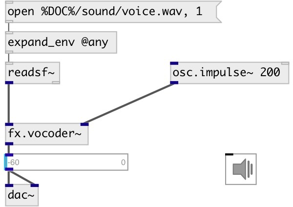

[index](index.html) :: [fx](category_fx.html)
---

# fx.vocoder~

###### простой вокодер, в котором спектр модулирующего сигнала анализируется с помощью 32-диапазонного фильтра

*доступно с версии:* 0.7

---

## методы:

* **reset**
reset object 

## свойства:

* **@osc** (initonly)
Запросить/установить OSC server name to listen 
_тип:_ symbol 

* **@id** (initonly)
Запросить/установить OSC address id. If specified, bind all properties to /ID/fx_vocoder/PROP_NAME
osc address, if empty bind to /fx_vocoder/PROP_NAME. 
_тип:_ symbol 

* **@active** 
Запросить/установить on/off dsp processing 
_тип:_ bool 
_по умолчанию:_ 1 

* **@attack** 
Запросить/установить attack time 
_тип:_ float 
_единица:_ ms 
_диапазон:_ 0.1..100 
_по умолчанию:_ 5 

* **@bwratio** 
Запросить/установить coefficient to adjust the bandwidth of each band 
_тип:_ float 
_диапазон:_ 0.1..2 
_по умолчанию:_ 0.5 

* **@release** 
Запросить/установить release time 
_тип:_ float 
_единица:_ ms 
_диапазон:_ 0.1..100 
_по умолчанию:_ 5 

## входы:

* modulation signal 
_тип:_ audio
* excitation/carrier signal 
_тип:_ audio

## выходы:

*   
_тип:_ audio

## ключевые слова:

[vocoder](keywords/vocoder.html)

**Авторы:** Serge Poltavsky

**Лицензия:** GPL3 or later

