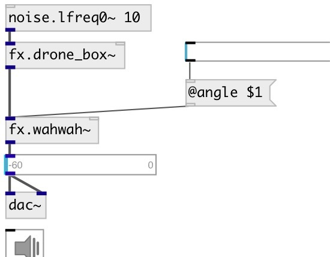

[index](index.html) :: [fx](category_fx.html)
---

# fx.wahwah~

###### digitized CryBaby wah pedal

*доступно с версии:* 0.6

---

## свойства:

* **@angle** 
Получить/установить pedal angle 
_тип:_ float 
_диапазон:_ 0..1 
_по умолчанию:_ 0.6 

* **@speed** 
Получить/установить automatisation speed 
_тип:_ float 
_единица:_ bpm 
_диапазон:_ 360..780 
_по умолчанию:_ 540 

* **@drywet** 
Получить/установить proportion of mix between the original (dry) and &#39;effected&#39; (wet) signals. 0 -
dry signal, 1 - wet. 
_тип:_ float 
_диапазон:_ 0..1 
_по умолчанию:_ 1 

* **@bypass** 
Получить/установить if set to 1 - bypass &#39;effected&#39; signal. 
_тип:_ int 
_варианты:_ 0, 1 
_по умолчанию:_ 0 

* **@active** 
Получить/установить on/off dsp processing 
_тип:_ int 
_варианты:_ 0, 1 
_по умолчанию:_ 1 

## входы:

* input signal 
_тип:_ audio

## выходы:

* None 
_тип:_ audio

## ключевые слова:

[wahwah](keywords/wahwah.html)
[guitar](keywords/guitar.html)
[crybaby](keywords/crybaby.html)

**Авторы:** Serge Poltavsky

**Лицензия:** GPL3 or later

