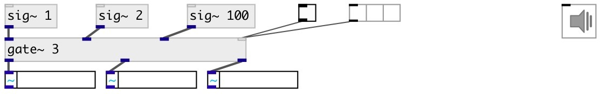

[index](index.html) :: [base](category_base.html)
---

# gate~

###### multislot signal gate

*доступно с версии:* 0.9.7

---

## аргументы:

* **N**
number of inputs/outputs 
_тип:_ int 

* **INIT**
initial open/close state for all slots 
_тип:_ bool 

## свойства:

* **@n** (initonly)
Запросить/установить number of [in|out]puts. 
_тип:_ int 
_диапазон:_ 1..64 
_по умолчанию:_ 1 

* **@smooth** 
Запросить/установить gain change smooth time 
_тип:_ float 
_единица:_ ms 
_диапазон:_ 0..1000 
_по умолчанию:_ 50 

* **@init** (initonly)
Запросить/установить init state for all slots. If true: all slots are open. 
_тип:_ bool 
_по умолчанию:_ true 

## входы:

* input signal 
_тип:_ audio
* ... input signal 
_тип:_ audio
* n-th input signal 
_тип:_ control
* on/off all channels 
_тип:_ control

## выходы:

* first output signal 
_тип:_ audio
* ... output signal 
_тип:_ audio
* n-th output signal 
_тип:_ audio

## ключевые слова:

[gate](keywords/gate.html)

**Авторы:** Serge Poltavsky

**Лицензия:** GPL3 or later

