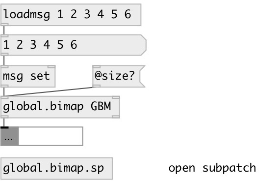

[index](index.html) :: [data](category_data.html)
---

# global.bimap

###### Global visibility bidirectional map container

*доступно с версии:* 0.9.7

---

## информация
NOTE: all object inlets are &#39;hot&#39;

## аргументы:

* **ID**
bimap ID 
_тип:_ symbol 

## методы:

* **clear**
clear bidirectional map content 

* **insert**
insert new left-right map entry 
  __параметры:__
  - **PAIR** list: LEFT_KEY RIGHT_KEY 
    тип: list  
    обязательно: True  

* **read**
read bimap from JSON file. Array of array pairs expected. 
  __параметры:__
  - **FNAME** path to file, absolute or relative 
    тип: symbol  
    обязательно: True  

* **set**
set bidirectional map content 
  __параметры:__
  - **DATA** new value list 
    тип: list  
    обязательно: True  

* **write**
write to JSON file, to overwrite existing file use @force flag 
  __параметры:__
  - **FNAME** path to file, absolute or relative 
    тип: symbol  
    обязательно: True  

  - **[@force]** force flag to overwrite existing files 
    тип: symbol  

## свойства:

* **@id** (initonly)
Запросить/установить global variable id 
_тип:_ symbol 
_по умолчанию:_ default 

* **@value** 
Запросить/установить value, list of pairs: LEFT_KEY1 RIGHT_KEY1 LEFT_KEY2 RIGHT_KEY2 etc. 
_тип:_ list 

* **@size** (readonly)
Запросить number of left-right pairs in map 
_тип:_ int 
_по умолчанию:_ 0 

* **@empty** (readonly)
Запросить true if empty 
_тип:_ bool 
_по умолчанию:_ 1 

* **@keys_left** (readonly)
Запросить list of left map keys 
_тип:_ list 

* **@keys_right** (readonly)
Запросить list of right map keys 
_тип:_ list 

## входы:

* try to find left key in the map and output the right value on success 
_тип:_ control
* try to find right key in the map and output the left value on success 
_тип:_ control

## выходы:

* atom or list: right value output 
_тип:_ control
* atom or list: left value output 
_тип:_ control

## ключевые слова:

[data](keywords/data.html)
[global](keywords/global.html)
[map](keywords/map.html)
[container](keywords/container.html)
[bidirectional](keywords/bidirectional.html)

**Смотрите также:**
[\[data.bimap\]](data.bimap.html)
[\[local.bimap\]](local.bimap.html)

**Авторы:** Serge Poltavsky

**Лицензия:** GPL3 or later

