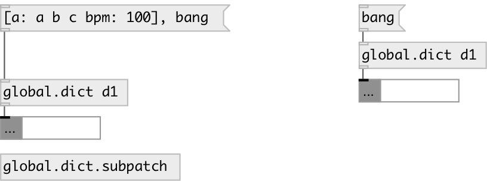

[index](index.html) :: [global](category_global.html)
---

# global.dict

###### global named dict object

*доступно с версии:* 0.6

---

## информация
Defines global scope dict variable, accessed by ID name and available from everywhere

## аргументы:

* **ID**
object ID 
_тип:_ symbol 

## методы:

* **[....]**
sets new content without output 

* **add**
adds entry to dictionary 
  __параметры:__
  - **KEY** entry key 
    тип: atom  
    обязательно: True  

  - **VAL** single value or list 
    тип: list  
    обязательно: True  

* **choose**
choose random key and output it 

* **clear**
removes all dict values. No output 

* **get_key**
get entry from dictionary 
  __параметры:__
  - **KEY** entry key 
    тип: atom  
    обязательно: True  

* **read**
read dict from JSON file 
  __параметры:__
  - **PATH** file path 
    тип: symbol  
    обязательно: True  

* **remove**
remove entry from dictionary 
  __параметры:__
  - **KEY** entry key 
    тип: atom  
    обязательно: True  

* **set**
set dict content without output 

* **set_key**
change entry in dictionary. If it&#39;s not exists, do nothing. 
  __параметры:__
  - **KEY** key 
    тип: atom  
    обязательно: True  

  - **VAL** single value or list 
    тип: list  
    обязательно: True  

* **write**
write dict as JSON file 
  __параметры:__
  - **PATH** file path 
    тип: symbol  
    обязательно: True  

## свойства:

* **@id** (initonly)
Запросить/установить global variable id 
_тип:_ symbol 
_по умолчанию:_ default 

* **@keys** (readonly)
Запросить keys of dictionary 
_тип:_ list 

* **@empty** (readonly)
Запросить 1 if dict is empty, otherwise 0 
_тип:_ bool 
_по умолчанию:_ 1 

* **@size** (readonly)
Запросить number of entries in dictionary 
_тип:_ int 
_минимальное значение:_ 0 
_по умолчанию:_ 0 

## входы:

* output current dictionary value 
_тип:_ control

## выходы:

* dict output 
_тип:_ control

## ключевые слова:

[dict](keywords/dict.html)
[local](keywords/local.html)
[global](keywords/global.html)

**Смотрите также:**
[\[data.dict\]](data.dict.html)
[\[global.dict\]](global.dict.html)

**Авторы:** Serge Poltavsky

**Лицензия:** GPL3 or later

