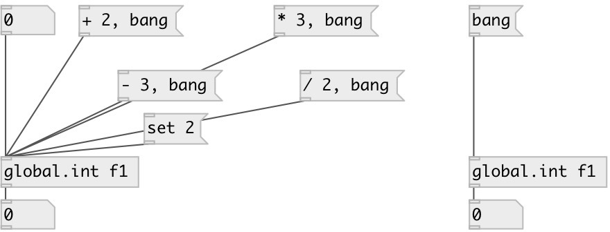

[index](index.html) :: [global](category_global.html)
---

# global.int

###### global named integer object

*доступно с версии:* 0.1

---

## информация
Defines global scope integer variable, accessed by ID name.

## аргументы:

* **ID**
object ID 
_тип:_ symbol 

## методы:

* **set**
sets new value without output 

* **+**
add to int, no output 

* **-**
substruct from int, no output 

* *****
multiply to, no output 

* **/**
divide by, no output 

## свойства:

* **@value** (readonly)
Запросить current value 
_тип:_ int 
_по умолчанию:_ 0 

## входы:

* outputs variable 
_тип:_ control

## выходы:

* int output 
_тип:_ control

## ключевые слова:

[int](keywords/int.html)
[global](keywords/global.html)

**Смотрите также:**
[\[global.float\]](global.float.html)

**Авторы:** Serge Poltavsky

**Лицензия:** GPL3 or later

