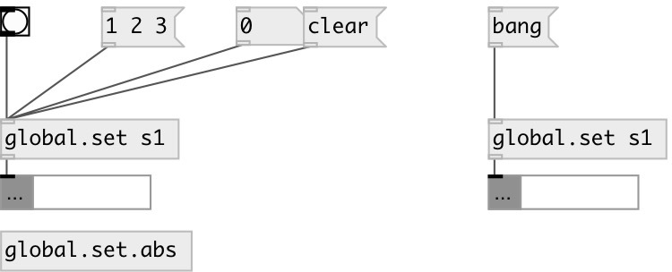

[index](index.html) :: [global](category_global.html)
---

# global.set

###### global named set object

*доступно с версии:* 0.6

---

## информация
Defines global scope set variable, accessed by ID name

## аргументы:

* **ID**
object ID 
_тип:_ symbol 

## методы:

* **add**
add values to the set 
  __параметры:__
  - **VAL** added values 
    тип: list  
    обязательно: True  

* **clear**
removes all set elements 

* **remove**
remove elements from the set 
  __параметры:__
  - **VAL** elements 
    тип: list  
    обязательно: True  

* **set**
sets new set content without output 
  __параметры:__
  - **LIST** new set content 
    тип: list  
    обязательно: True  

## свойства:

* **@empty** (readonly)
Получить 1 if list is empty, otherwise 0 
_тип:_ int 
_варианты:_ 0, 1 
_по умолчанию:_ 1 

* **@size** (readonly)
Получить number of elements in list 
_тип:_ int 
_минимальное значение:_ 0 
_по умолчанию:_ 0 

## входы:

* output set content 
_тип:_ control

## выходы:

* set output 
_тип:_ control

## ключевые слова:

[set](keywords/set.html)
[local](keywords/local.html)
[global](keywords/global.html)

**Смотрите также:**
[\[data.set\]](data.set.html)
[\[local.set\]](local.set.html)

**Авторы:** Serge Poltavsky

**Лицензия:** GPL3 or later

