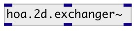

[index](index.html) :: [spat](category_spat.html)
---

# hoa.2d.exchanger~

###### renumbers and normalizes the channels

*доступно с версии:* 0.9.7

---

## информация
The library default normalization is SN3D and the numbering is ACN (cf tutorials). The exchangers will always convert from or to the standard.

## аргументы:

* **ORDER**
the order of decomposition 
_тип:_ int 

* **NUM**
numbering scheme 
_тип:_ symbol 

* **NORM**
normalization 
_тип:_ symbol 

## свойства:

* **@order** (initonly)
Запросить/установить the order of decomposition 
_тип:_ int 
_диапазон:_ 1..63 
_по умолчанию:_ 1 

* **@num** 
Запросить/установить numbering scheme 
_тип:_ symbol 
_варианты:_ ACN, fromFurseMalham, fromSID, toFurseMalham, toSID 
_по умолчанию:_ ACN 

* **@norm** 
Запросить/установить normalization 
_тип:_ symbol 
_варианты:_ SN2D, fromMaxN, toMaxN 
_по умолчанию:_ SN2D 

* **@toB** 
Запросить/установить alias to @num toFurseMalham and @norm toMaxN 
_тип:_ alias 

* **@fromB** 
Запросить/установить alias to @num fromFurseMalham and @norm fromMaxN 
_тип:_ alias 

## входы:

* first input harmonic 
_тип:_ audio
* ... input harmonic 
_тип:_ audio
* n-th input harmonic 
_тип:_ audio

## выходы:

* first loudspeaker output 
_тип:_ audio
* ... loudspeaker output 
_тип:_ audio
* n-th loudspeaker output 
_тип:_ audio

## ключевые слова:

[hoa](keywords/hoa.html)
[exchanger](keywords/exchanger.html)

**Смотрите также:**
[\[hoa.3d.exchanger~\]](hoa.3d.exchanger~.html)

**Авторы:** Serge Poltavsky, Pierre Guillot, Eliott Paris, Thomas Le Meur

**Лицензия:** GPL3 or later

