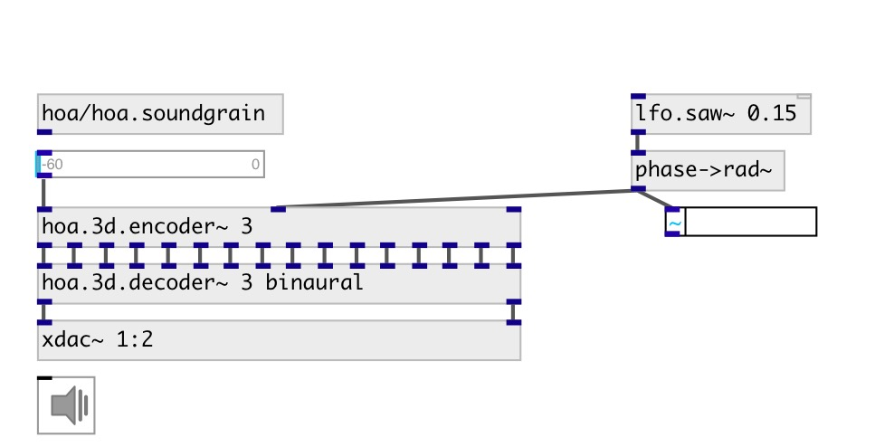

[index](index.html) :: [spat](category_spat.html)
---

# hoa.3d.decoder~

###### hoa 3d decoder

*доступно с версии:* 0.9.7

---

## информация
Decodes an ambisonics soundfield for several loudspeakers configuration or for headphones.

## аргументы:

* **ORDER**
the order of decomposition 
_тип:_ int 

* **MODE**
decoding mode 
_тип:_ symbol 

* **NCH**
number of loud speakers 
_тип:_ int 

## свойства:

* **@order** (initonly)
Запросить/установить the order of decomposition 
_тип:_ int 
_диапазон:_ 1..10 
_по умолчанию:_ 1 

* **@mode** 
Запросить/установить decoding mode 
_тип:_ symbol 
_варианты:_ regular, binaural 
_по умолчанию:_ regular 

* **@regular** 
Запросить/установить alias for @mode regular 
_тип:_ alias 

* **@binaural** 
Запросить/установить alias for @mode binaural 
_тип:_ alias 

* **@offset** 
Запросить/установить rotation of loudspeakers. Only available for @regular and @irregular mode. 
_тип:_ list 
_единица:_ deg 
_по умолчанию:_ 0 0 0 

* **@angles** 
Запросить/установить angles of loudspeakers. 
_тип:_ list 
_единица:_ deg 
_по умолчанию:_ 0 90 0 340.5288 120 340.5288 240 340.5288 

* **@pw_x** (readonly)
Запросить list of plain wave x-coordinates (abscissas). -1 is the left of the soundfield,
0 is the center of the soundfield and 1 is the right of the soundfield. 
_тип:_ list 
_единица:_ rad 
_диапазон:_ -1..1 
_по умолчанию:_ 0.0 -0.0 -0.8165 0.8165 

* **@pw_y** (readonly)
Запросить list of plain wave y-coordinates (ordinatas). -1 is the back of the soundfield,
0 is the center of the soundfield and 1 is the front of the soundfield. 
_тип:_ list 
_единица:_ rad 
_диапазон:_ -1..1 
_по умолчанию:_ -0.0 0.9428 -0.4714 -0.4714 

* **@pw_z** (readonly)
Запросить list of plain wave z-coordinates (heights). -1 is the bottom of the soundfield,
0 is the center of the soundfield and 1 is the top of the soundfield. 
_тип:_ list 
_единица:_ rad 
_диапазон:_ -1..1 
_по умолчанию:_ 1 -0.3333 -0.3333 -0.3333 

* **@nharm** (readonly)
Запросить number of circular harmonics. 
_тип:_ int 
_минимальное значение:_ 1 
_по умолчанию:_ 4 

* **@nch** (initonly)
Запросить/установить number of plain waves. 
_тип:_ int 
_минимальное значение:_ 1 
_по умолчанию:_ 0 

## входы:

* first input harmonic 
_тип:_ audio
* ... input harmonic 
_тип:_ audio
* n-th input harmonic 
_тип:_ audio

## выходы:

* first loudspeaker output 
_тип:_ audio
* ... loudspeaker output 
_тип:_ audio
* n-th loudspeaker output 
_тип:_ audio

## ключевые слова:

[hoa](keywords/hoa.html)
[decoder](keywords/decoder.html)

**Смотрите также:**
[\[hoa.3d.encoder~\]](hoa.3d.encoder~.html)
[\[hoa.2d.decoder~\]](hoa.2d.decoder~.html)

**Авторы:** Serge Poltavsky, Pierre Guillot, Eliott Paris, Thomas Le Meur

**Лицензия:** GPL3 or later

