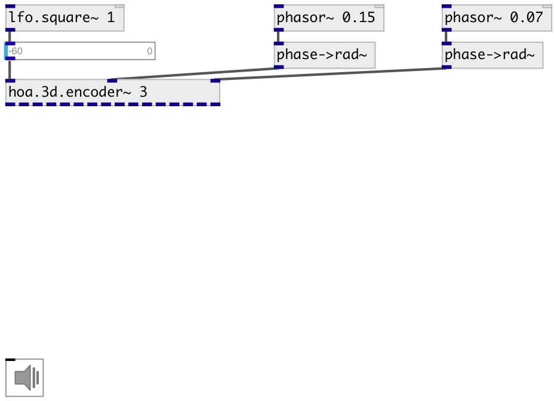

[index](index.html) :: [spat](category_spat.html)
---

# hoa.3d.encoder~

###### hoa 3d encoder

*доступно с версии:* 0.9.7

---

## информация
Creates the circular harmonics of a signal depending of a given order, position on a circle in radians (θ) and elevation

## аргументы:

* **ORDER**
the order of decomposition 
_тип:_ int 

## свойства:

* **@order** (initonly)
Запросить/установить the order of decomposition 
_тип:_ int 
_диапазон:_ 1..10 
_по умолчанию:_ 1 

## входы:

* input signal 
_тип:_ audio
* position on a circle (azimuth) in radians 
_тип:_ audio
* elevation in radians 
_тип:_ audio

## выходы:

* first circular harmonics output 
_тип:_ audio
* ... circular harmonics output 
_тип:_ audio
* n-th circular harmonics output 
_тип:_ audio

## ключевые слова:

[hoa](keywords/hoa.html)
[encoder](keywords/encoder.html)

**Смотрите также:**
[\[hoa.3d.decoder~\]](hoa.3d.decoder~.html)
[\[hoa.2d.encoder~\]](hoa.2d.encoder~.html)

**Авторы:** Serge Poltavsky, Pierre Guillot, Eliott Paris, Thomas Le Meur

**Лицензия:** GPL3 or later

