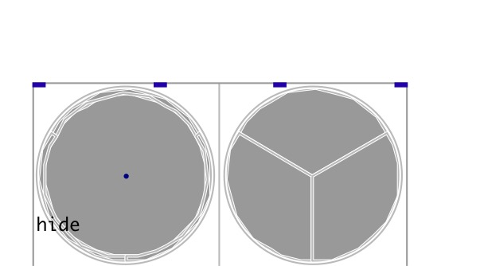

[index](index.html) :: [spat](category_spat.html)
---

# hoa.3d.meter~

###### multi spherical meter with sound field descriptor

*доступно с версии:* 0.9.7

---

## информация
displays the peak levels for a spherical array of loudspeakers. It computes and displays the energy and velocity vectors.

## методы:

* **pos**
set UI element position 
  __параметры:__
  - **X** top left x-coord 
    тип: float  
    обязательно: True  

  - **Y** top right y-coord 
    тип: float  
    обязательно: True  

## свойства:

* **@channels** 
Запросить/установить number of input channels 
_тип:_ int 
_диапазон:_ 1..64 
_по умолчанию:_ 4 

* **@send** 
Запросить/установить send destination 
_тип:_ symbol 
_по умолчанию:_ (null) 

* **@receive** 
Запросить/установить receive source 
_тип:_ symbol 
_по умолчанию:_ (null) 

* **@size** 
Запросить/установить element size (width, height pair) 
_тип:_ list 
_по умолчанию:_ 225 225 

* **@pinned** 
Запросить/установить pin mode. if 1 - put element to the lowest level 
_тип:_ bool 
_по умолчанию:_ 0 

* **@background_color** 
Запросить/установить element background color (list of red, green, blue values in 0-1 range) 
_тип:_ list 
_по умолчанию:_ 0.93 0.93 0.93 1 

* **@border_color** 
Запросить/установить border color (list of red, green, blue values in 0-1 range) 
_тип:_ list 
_по умолчанию:_ 0.6 0.6 0.6 1 

* **@fontsize** 
Запросить/установить fontsize 
_тип:_ int 
_диапазон:_ 4..100 
_по умолчанию:_ 11 

* **@fontname** 
Запросить/установить fontname 
_тип:_ symbol 
_варианты:_ Courier, DejaVu, Helvetica, Monaco, Times 
_по умолчанию:_ Helvetica 

* **@fontweight** 
Запросить/установить font weight 
_тип:_ symbol 
_варианты:_ normal, bold 
_по умолчанию:_ normal 

* **@fontslant** 
Запросить/установить font slant 
_тип:_ symbol 
_варианты:_ roman, italic 
_по умолчанию:_ roman 

* **@over_color** 
Запросить/установить peak overload color 
_тип:_ list 
_по умолчанию:_ 1 0 0 0.8 

* **@hot_color** 
Запросить/установить color for &gt;=-12db. 
_тип:_ list 
_по умолчанию:_ 1 0.6 0 0.8 

* **@warm_color** 
Запросить/установить color for &gt;=-21db. 
_тип:_ list 
_по умолчанию:_ 0.85 0.85 0 0.8 

* **@tepid_color** 
Запросить/установить color for &gt;=-30db. 
_тип:_ list 
_по умолчанию:_ 0.6 0.73 0 0.8 

* **@cold_color** 
Запросить/установить color for &gt;=-39db. 
_тип:_ list 
_по умолчанию:_ 0 0.6 0 0.8 

* **@energy_color** 
Запросить/установить energy vector color 
_тип:_ list 
_по умолчанию:_ 0 0 1 0.8 

* **@velocity_color** 
Запросить/установить velocity vector 
_тип:_ list 
_по умолчанию:_ 1 0 0 0.8 

* **@label** 
Запросить/установить label text 
_тип:_ symbol 
_по умолчанию:_ (null) 

* **@label_color** 
Запросить/установить label color in RGB format within 0-1 range, for example: 0.2 0.4 0.1 
_тип:_ list 
_по умолчанию:_ 0 0 0 1 

* **@label_inner** 
Запросить/установить label position (1 - inner, 0 - outer). 
_тип:_ bool 
_по умолчанию:_ 0 

* **@label_align** 
Запросить/установить label horizontal align 
_тип:_ symbol 
_варианты:_ left, center, right 
_по умолчанию:_ left 

* **@label_valign** 
Запросить/установить label vertical align 
_тип:_ symbol 
_варианты:_ top, center, bottom 
_по умолчанию:_ top 

* **@label_side** 
Запросить/установить label snap side 
_тип:_ symbol 
_варианты:_ left, top, right, bottom 
_по умолчанию:_ top 

* **@label_margins** 
Запросить/установить label offset in pixels 
_тип:_ list 
_по умолчанию:_ 0 0 

* **@interval** 
Запросить/установить refresh interval 
_тип:_ int 
_единица:_ ms 
_диапазон:_ 20..1000 
_по умолчанию:_ 50 

* **@clockwise** 
Запросить/установить clockwise channel numbering mode 
_тип:_ bool 
_по умолчанию:_ 0 

* **@offset** 
Запросить/установить channel numbering offset for each axes 
_тип:_ list 
_по умолчанию:_ 0 0 0 

* **@angles** 
Запросить/установить channel layout angles 
_тип:_ list 
_по умолчанию:_ 0 90 0 -19.5 120 -19.5 240 -19.5 

* **@vectors** 
Запросить/установить vector display mode 
_тип:_ symbol 
_варианты:_ both, energy, none, velocity 
_по умолчанию:_ energy 

* **@view** 
Запросить/установить view mode 
_тип:_ symbol 
_варианты:_ bottom, top, topnextbottom, toponbottom 
_по умолчанию:_ top 

## входы:

* first source input 
_тип:_ audio
* ... source input 
_тип:_ audio
* n-th source input 
_тип:_ audio

## выходы:

* first harmonic output 
_тип:_ audio
* ... harmonic output 
_тип:_ audio
* n-th harmonic output 
_тип:_ audio

## ключевые слова:

[hoa](keywords/hoa.html)
[meter](keywords/meter.html)
[3d](keywords/3d.html)

**Авторы:** Serge Poltavsky, Pierre Guillot, Eliott Paris, Thomas Le Meur

**Лицензия:** GPL3 or later

