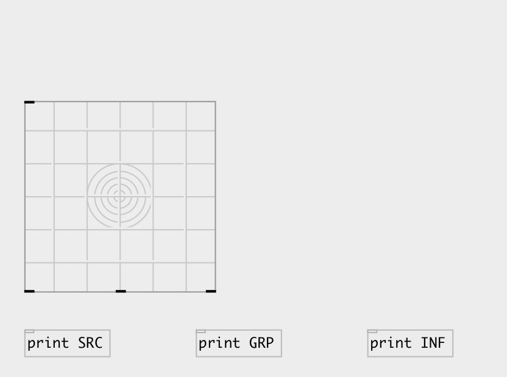

[index](index.html) :: [spat](category_spat.html)
---

# hoa.map.ui

###### a GUI to spatialize sources on a map

*доступно с версии:* 0.9.7

---

## информация
[hoa.map.ui] allows you to spatialize several sources on a plane to control [hoa.2d.map~] or [hoa.3d.map]. You can add and remove sources, change coordinates, add description and create groups.

## методы:

* **clear**
clears specified preset 
  __параметры:__
  - **IDX** preset index 
    тип: int  
    обязательно: True  

* **dump**
dumps all object info to Pd console window 

* **interp**
for this object acts as *load*, no interpolation performed 

* **load**
loads specified preset 
  __параметры:__
  - **IDX** preset index 
    тип: int  
    обязательно: True  

* **pos**
set UI element position 
  __параметры:__
  - **X** top left x-coord 
    тип: float  
    обязательно: True  

  - **Y** top right y-coord 
    тип: float  
    обязательно: True  

* **set**
sets toggle state without output 

* **store**
stores specified preset 
  __параметры:__
  - **IDX** preset index 
    тип: int  
    обязательно: True  

* **info**
outputs info to 3rd outlet 

* **clear_all**
remove all sources from map 

* **group**
group operations 
  __параметры:__
  - **IDX** group index 
    тип: int  
    обязательно: True  

  - **ACTION** action 
    тип: symbol  
    обязательно: True  

  - **[ARGS]** action arguments 
    тип: list  

* **source**
source operations 
  __параметры:__
  - **IDX** source index 
    тип: int  
    обязательно: True  

  - **ACTION** action 
    тип: symbol  
    обязательно: True  

  - **[ARGS]** action arguments 
    тип: list  

## свойства:

* **@presetname** 
Запросить/установить preset name for using with [ui.preset] 
_тип:_ symbol 
_по умолчанию:_ (null) 

* **@send** 
Запросить/установить send destination 
_тип:_ symbol 
_по умолчанию:_ (null) 

* **@receive** 
Запросить/установить receive source 
_тип:_ symbol 
_по умолчанию:_ (null) 

* **@size** 
Запросить/установить element size (width, height pair) 
_тип:_ list 
_по умолчанию:_ 225 225 

* **@pinned** 
Запросить/установить pin mode. if 1 - put element to the lowest level 
_тип:_ bool 
_по умолчанию:_ 0 

* **@background_color** 
Запросить/установить element background color (list of red, green, blue values in 0-1 range) 
_тип:_ list 
_по умолчанию:_ 0.93 0.93 0.93 1 

* **@selection_color** 
Запросить/установить selection color (list of red, green, blue values in 0-1 range) 
_тип:_ list 
_по умолчанию:_ 0 0.75 1 1 

* **@border_color** 
Запросить/установить border color (list of red, green, blue values in 0-1 range) 
_тип:_ list 
_по умолчанию:_ 0.6 0.6 0.6 1 

* **@fontsize** 
Запросить/установить fontsize 
_тип:_ int 
_диапазон:_ 4..100 
_по умолчанию:_ 11 

* **@fontname** 
Запросить/установить fontname 
_тип:_ symbol 
_варианты:_ Courier, DejaVu, Helvetica, Monaco, Times 
_по умолчанию:_ Helvetica 

* **@fontweight** 
Запросить/установить font weight 
_тип:_ symbol 
_варианты:_ normal, bold 
_по умолчанию:_ normal 

* **@fontslant** 
Запросить/установить font slant 
_тип:_ symbol 
_варианты:_ roman, italic 
_по умолчанию:_ roman 

* **@label** 
Запросить/установить label text 
_тип:_ symbol 
_по умолчанию:_ (null) 

* **@label_color** 
Запросить/установить label color in RGB format within 0-1 range, for example: 0.2 0.4 0.1 
_тип:_ list 
_по умолчанию:_ 0 0 0 1 

* **@label_inner** 
Запросить/установить label position (1 - inner, 0 - outer). 
_тип:_ bool 
_по умолчанию:_ 0 

* **@label_align** 
Запросить/установить label horizontal align 
_тип:_ symbol 
_варианты:_ left, center, right 
_по умолчанию:_ left 

* **@label_valign** 
Запросить/установить label vertical align 
_тип:_ symbol 
_варианты:_ top, center, bottom 
_по умолчанию:_ top 

* **@label_side** 
Запросить/установить label snap side 
_тип:_ symbol 
_варианты:_ left, top, right, bottom 
_по умолчанию:_ top 

* **@label_margins** 
Запросить/установить label offset in pixels 
_тип:_ list 
_по умолчанию:_ 0 0 

* **@zoom** 
Запросить/установить zoom factor 
_тип:_ float 
_диапазон:_ 0.01..1 
_по умолчанию:_ 0.35 

* **@view** 
Запросить/установить coordinate view 
_тип:_ symbol 
_варианты:_ xy, xz, yz 
_по умолчанию:_ xy 

* **@mapname** 
Запросить/установить widget name to link them between 
_тип:_ symbol 
_по умолчанию:_ (null) 

* **@outputmode** 
Запросить/установить output mode 
_тип:_ symbol 
_варианты:_ polar, cartesian 
_по умолчанию:_ polar 

## входы:

* output group and source info 
_тип:_ control

## выходы:

* source output 
_тип:_ control
* group output 
_тип:_ control
* info output 
_тип:_ control

## ключевые слова:

[hoa](keywords/hoa.html)
[map](keywords/map.html)

**Авторы:** Serge Poltavsky, Pierre Guillot, Eliott Paris, Thomas Le Meur

**Лицензия:** GPL3 or later

