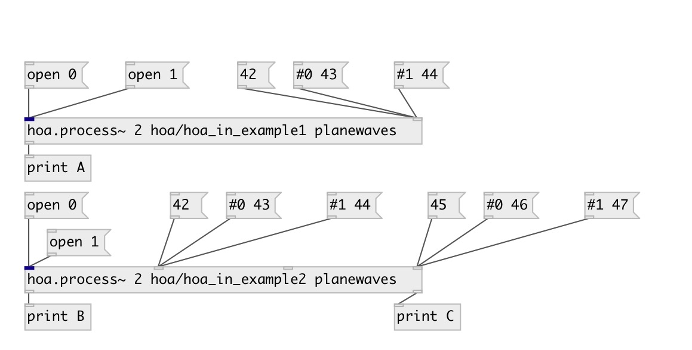

[index](index.html) :: [spat](category_spat.html)
---

# hoa.out

###### message outlet for a patcher loaded by hoa.process~

*доступно с версии:* 0.8

---

## информация
hoa.out defines a message outlet for a patcher loaded by a hoa.process~ object.

## аргументы:

* **INDEX**
outlet index 
_тип:_ int 

## свойства:

* **@index** 
Запросить/установить outlet index 
_тип:_ int 
_минимальное значение:_ 1 
_по умолчанию:_ 1 

## входы:

* output bang message in the corresponding hoa.process~ object&#39;s message outlet 
_тип:_ control

## ключевые слова:

[hoa](keywords/hoa.html)
[outlet](keywords/outlet.html)

**Смотрите также:**
[\[hoa.out~\]](hoa.out~.html)
[\[hoa.in\]](hoa.in.html)
[\[hoa.in~\]](hoa.in~.html)

**Авторы:** Serge Poltavsky, Pierre Guillot, Eliott Paris, Thomas Le Meur

**Лицензия:** GPL3 or later

