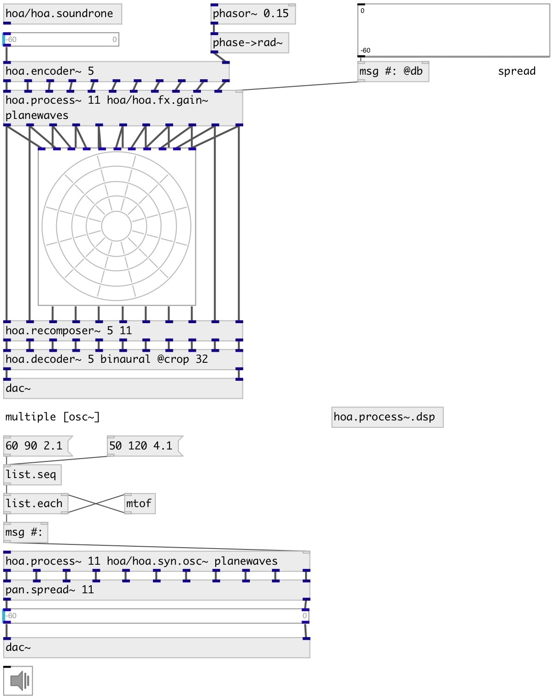

[index](index.html) :: [spat](category_spat.html)
---

# hoa.process~

###### patcher loader for multichannel processing

*доступно с версии:* 0.8

---

## информация
hoa.process~ helps the modularization of patches for ambisonic or plane waves processing. hoa.process~ is a kind of poly~ object particulary suitable for multichannel ambisonic or plane wave processing. Create a patch/effect/operator, then parallelize it with the hoa.process~

## аргументы:

* **N**
the order of decomposition 
_тип:_ int 

* **PATCH**
patch name 
_тип:_ symbol 

* **DOMAIN**
process domain: harmonics or planewaves 
_тип:_ symbol 

* **ARGS**
instance arguments 
_тип:_ list 

## методы:

* **dump**
dumps all object info to Pd console window. 

* **open**
open Pd window for specified instance 
  __параметры:__
  - **IDX** instance index 
    тип: int  
    обязательно: True  

* **on**
switch on/off DSP instance processing. Usage: on all 0|1 - turn on/off all
instances, on IDX 0|1 - turn on/off specified instance. 

## свойства:

* **@n** (initonly)
Запросить/установить the order of decomposition/number of planewaves 
_тип:_ int 
_диапазон:_ 0..63 
_по умолчанию:_ 0 

* **@patch** (initonly)
Запросить/установить patch name 
_тип:_ symbol 

* **@domain** (initonly)
Запросить/установить process domain: harmonics or planewaves 
_тип:_ symbol 
_варианты:_ harmonics, planewaves 
_по умолчанию:_ harmonics 

* **@args** (initonly)
Запросить/установить arguments passed to instances 
_тип:_ list 

## входы:

* first input harmonic/planewave 
_тип:_ audio
* ... input harmonic/planewave 
_тип:_ audio
* n-th input harmonic/planewave 
_тип:_ audio

## выходы:

* first harmonic/planewave output 
_тип:_ audio
* ... harmonic/planewave output 
_тип:_ audio
* n-th harmonic/planewave output 
_тип:_ audio

## ключевые слова:

[hoa](keywords/hoa.html)
[process](keywords/process.html)
[2d](keywords/2d.html)

**Смотрите также:**
[\[hoa.2d.decoder~\]](hoa.2d.decoder~.html)

**Авторы:** Serge Poltavsky, Pierre Guillot, Eliott Paris, Thomas Le Meur

**Лицензия:** GPL3 or later

